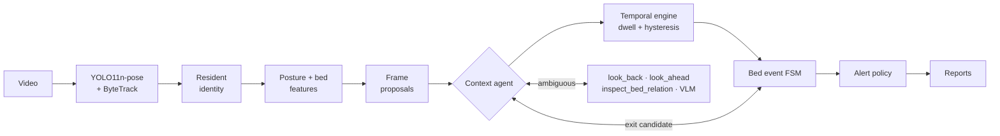

# Elder Monitor — agentic vision prototype for bed-exit monitoring

Analyses a continuous indoor video of one resident and reports what they are doing over time, when they
leave and return to bed, how long each state lasts, and whether anything needs `NORMAL`, `MONITOR` or `ALERT`.

Pretrained pose estimation handles every frame, and explicit temporal logic turns frames into states and
events. A context agent is only invoked when an observation is ambiguous. It chooses bounded tools (look back,
look ahead, bed-relation geometry, a Qwen2.5-VL check) and returns evidence that the temporal engine and the
bed-event state machine still have to accept.

## Architecture



Full diagram and module map: [docs/architecture.md](docs/architecture.md).

## Setup

```bash
python -m venv .venv && source .venv/bin/activate     # Windows: .venv\Scripts\activate
pip install -e ".[vlm,dev]"                           # drop "vlm" to run geometry-only
```

`yolo11n-pose.pt` downloads on first use. `Qwen/Qwen2.5-VL-3B-Instruct` (~7.5 GB) downloads the first time the
agent actually needs it; `--no-vlm` skips it. A CUDA GPU is optional. All parameters live in
[src/elder_monitor/default.yaml](src/elder_monitor/default.yaml); a scene file only needs the bed polygon.

## Run

```bash
# 1. mark the bed (and chairs), optionally click the resident; writes configs/demo.yaml + a preview png
python -m elder_monitor calibrate --video data/demo.mp4 --output configs/demo.yaml

# 2. analyse
python -m elder_monitor analyze --video data/demo.mp4 --config configs/demo.yaml --output outputs/demo --overlay

# 3. baseline without the context agent, re-using the first run's detections
python -m elder_monitor analyze --video data/demo.mp4 --config configs/demo.yaml --output outputs/demo_baseline \
    --no-agent --observations outputs/demo/observations.jsonl

# 4. evaluate one or more clips against labels (format: annotations/TEMPLATE.json)
python -m elder_monitor evaluate --predictions outputs/demo --annotations annotations/demo.json \
    --output evaluation/demo --videos data/demo.mp4

# reproduce the bundled example on public clips (drop --vlm for geometry-only)
python examples/run_examples.py --vlm

pytest -q
```

Perception (detections, tracking, identity and per-frame bed geometry) is cached in `observations.jsonl`; with
`--reuse`, anything outside `scene`, `target`, `sampling`, `vision`, `identity` and `posture.speed_window_sec` can be
retuned without running the detector again.
Frames are sampled at 5 fps (or the source rate if lower), using decoded timestamps.

### Outputs (`outputs/<run>/`)

| File | Contents |
|---|---|
| `timeline.txt`, `timeline.csv` | Activity timeline (`00:00 – 04:32  LYING_IN_BED`) |
| `bed_timeline.csv` | Bed status `IN_BED` / `OUT_OF_BED` / `UNKNOWN` |
| `decisions.csv` | `NORMAL` / `MONITOR` / `ALERT` intervals with reason codes |
| `events.json` | Bed exits / returns (start + confirmation time, states, confidence, decision, evidence), alert episodes, rejected and unresolved candidates |
| `summary.json` | Seconds per state, bed totals, counts, longest out-of-bed period, final state, camera-placement check (`view_quality`); a `human` block in `11m 42s` form |
| `agent_trace.jsonl` | Every context request: trigger, tools, windows, findings, outcome |
| `proposals.csv`, `observations.jsonl` | Frame-level evidence for debugging |
| `run_manifest.json` | Video hash, config (+hash), models, runtime, VLM call count |
| `overlay.mp4` | Optional visual check of bed region, keypoints, state and decision |

## API: upload and live webcam

`serve` puts the same pipeline behind a small HTTP + WebSocket API. It is optional; the CLI does everything the
assignment asks. A browser frontend was built for it but is not part of this submission (the brief does not ask for
one); `--frontend <folder>` serves any static frontend at `/`.

```bash
pip install -e ".[api]"
python -m elder_monitor serve --config configs/demo.yaml    # API at http://127.0.0.1:8000/api/health
```

- **Upload** (`POST /api/jobs`): the video runs through the full pipeline in the background. The result holds the
  activity / bed / decision timelines, the summary, bed events, alert episodes, the agent's messages and the per-sample
  poses.
- **Live webcam** (`WS /api/live`): a client sends 640 px JPEG frames at 5 fps. Each frame goes through the same pose
  tracker and target selector, then `run_analysis` re-runs over the whole session so far (about 16 ms for a 5-minute
  session and 130 ms for 30 minutes on the development machine). Live decisions therefore come from exactly the
  offline temporal engine, agent and policy; only messages not sent before are pushed to the client. Questions (status,
  exits, alerts, how long) are answered from that live result. The VLM is not used live.

| Endpoint | |
|---|---|
| `GET /api/health` | Default bed polygon and sampling fps |
| `POST /api/jobs` | Multipart `file`, optional `bed_polygon` (JSON) and `use_vlm`; returns the job, which runs in the background |
| `GET /api/jobs`, `GET /api/jobs/{id}` | Job list; status, progress and, when done, the result (timelines, events, alerts, chat messages, per-sample poses) |
| `GET /api/jobs/{id}/video` | The uploaded video |
| `WS /api/live` | Send `{"type": "start", "bed_polygon": [...]}`, then JPEG frames as binary messages; each reply has the current state, decision, pose and new chat messages. `{"type": "ask", "text": "..."}` gets an answer |

Uploads and results are kept in `runs/<id>/` (the usual output files plus `result.json`). Live timestamps are the
server's receive times, and live states commit after the same 1–2 s dwell as offline. Browsers only allow the camera
on `localhost` or HTTPS.

## States

Two timelines are kept. **Activity** has exactly one label at a time; **bed status** is derived from it.
Both are gap-free half-open intervals covering `[0, T)`, so each sums exactly to the video length.

| Activity | Evidence | Bed status |
|---|---|---|
| `LYING_IN_BED` | body axis ≥ 60° from vertical (leave below 45°) with hips / body on the bed polygon | IN_BED |
| `SITTING_ON_BED` | upright with hips on the bed; legs seated, hidden, or stretched out on the mattress | IN_BED |
| `SITTING_OUTSIDE_BED` | upright with seated legs or hips in a chair polygon, outside the bed | OUT_OF_BED |
| `STANDING` | upright, extended legs, feet off the mattress, little movement | OUT_OF_BED |
| `WALKING` | upright and moving ≥ 0.5 torso lengths/s (leave below 0.3) | OUT_OF_BED |
| `OUT_OF_BED` | outside the bed but the finer posture is unresolved (coarse fallback) | OUT_OF_BED |
| `LYING_ON_FLOOR` | lying outside the bed polygon; added because it drives the most important alert | OUT_OF_BED |
| `UNKNOWN` | not detected, too few keypoints, identity uncertain, or posture unclear | UNKNOWN |

Per-frame cues come from the 17 COCO keypoints. The body axis is shoulder-to-hip, or hip-to-ankle when the
shoulders are out of frame. A short torso relative to shoulder width on the bed (legs hidden) means lying along
the camera axis. Legs are seated when the knee angle is < 140° (side view) or the thigh is foreshortened relative
to the shin (< 0.72, thigh pointing at the camera), with knee drop or thigh angle as fall-backs when the ankles
are hidden. Straight legs only mean standing when they are roughly vertical, and seated legs within the edge margin of
the bed outline count as sitting on the bed. The box aspect is only used when no body axis is measurable and the box is
not cut by the frame edge; hips over the bed with no measurable posture stay `UNKNOWN`. When the joints drop out right
after standing or walking (someone walking past the lens), the tracked box keeps the label `WALKING` while it moves at
walking speed without changing shape.

Temporal handling: a centred 5-sample majority filter, then a state is committed only after it persists for its
dwell time (1 s; 2 s for `UNKNOWN` and `LYING_ON_FLOOR`) and the boundary is backdated to where it began. If
labels keep alternating so that none can settle, the latest one is committed after 4 s rather than keeping a stale
state. Short dropouts are absorbed; gaps longer than 2 s become `UNKNOWN` instead of being forced into a class.
`UNKNOWN` straight after `WALKING` that lasts to the end of the recording (walked out of view) commits after 1 s.

## Bed exit and return

A state machine runs over the committed timelines:
`UNINITIALIZED → IN_BED_BASELINE → EXIT_PENDING → AWAY_EPISODE → RETURN_PENDING → IN_BED_BASELINE`.

- **Candidate**: from an in-bed baseline the bed status turns `OUT_OF_BED` (this is the exit `start_time`).
- **BED_EXIT confirmed** (`confirmed_time`) when the resident has moved away: observed walking or beyond the
  near-bed band (bed polygon + 0.08·H) for 2 s; or walking and then out of view for 1 s without getting back into
  bed; or observed out of bed for 30 s even beside the bed (bedside chair). Standing still beside the bed resets the
  count; unseen time only pauses it. A tracked box still moving at walking speed when the joints drop out counts as
  walking if the resident is then lost from view. Emitted once per episode, with the agent's evidence attached.
- **Not an exit**: sitting up, turning, edge-sitting, or standing next to the bed and sitting back down (the
  candidate is rejected when bed status returns to `IN_BED` before departure).
- **RETURN_TO_BED**: after an away episode the resident re-occupies the bed (occurrence time) and lies down for
  2 s (confirmation). A brief stand in between (no departure, under 30 s) keeps the first sit-down as the occurrence
  time. `events.return_rule: sitting` switches to the looser "stable sitting" rule.
- A video that starts outside the bed opens an away episode without an exit. Candidates still pending at the end
  of the video are reported as unresolved and not counted.

Annotation policy to match: exit time = the moment the resident stands up off the bed; return time = the moment
they sit back on it.

## Agent

The agent is deterministic and budgeted. It decides *whether* more context is needed and *which* tool to use next,
and stops as soon as the evidence is sufficient.

| Trigger | Raised when | Tool sequence |
|---|---|---|
| `EXIT_CANDIDATE` | bed status turns `OUT_OF_BED` from the in-bed baseline | `look_back` for the majority state before (8 s, then 16 s) → `look_ahead` departure check over 8 s, extended once; still unresolved → re-checked later with a new window. One trace record per candidate with the final outcome |
| `LYING_OUTSIDE_BED` | ≥ 2 s lying with hips outside the bed polygon | `inspect_bed_relation`; under a quarter of the keypoints on the mattress → floor (fail-safe). Otherwise `inspect_target_crop` (VLM bed / floor) → `look_back` (came from lying in bed → bed), otherwise floor. Samples fully off the mattress always stay floor |
| `AMBIGUOUS_GAP` | ≥ 2 s of `UNKNOWN` proposals | `look_back` + `look_ahead` for the states right next to the gap. In bed on both sides and either lying on both sides (blanket) or an identity conflict (caregiver in front), ≤ 30 s → bridge. Otherwise the VLM checks 3 frames across the gap and must agree (not for an identity conflict outside the bed). Resident last seen leaving the frame and no longer detected, or no agreement → `abstain` (stays `UNKNOWN`) |
| `UPRIGHT_ON_BED_REGION` | 1–30 s of `STANDING` with the hips over the bed in ≥ 80% of samples, never at walking speed, with `SITTING_ON_BED` before and after (≥ 1 s after) | `inspect_bed_relation` → `look_back` + `look_ahead` → the VLM checks 3 frames; all three "sitting on the bed" → `SITTING_ON_BED` (edge-sitting facing the camera, where seated legs look straight), otherwise `STANDING` is kept. Only with a VLM |

Budgets: two context rounds per trigger, three VLM frames per trigger, 60 VLM calls per run. VLM replies must be
valid JSON with allowed values; rejected replies are logged raw. A failed VLM load or call falls back to geometry.
Real trace from `examples/outputs/pexels_4052924/agent_trace.jsonl` (the man gets out of bed at 23 s):

```json
{"trigger": "EXIT_CANDIDATE", "window": [23.4, 25.6],
 "steps": [{"action": "look_back", "window": [15.4, 23.4],
            "finding": {"label": "SITTING_ON_BED", "share": 0.95, "seconds_before": 0.6}},
           {"action": "look_ahead", "window": [23.4, 27.88],
            "finding": "walks away from the bed; departure confirmed at 25.6s"}],
 "outcome": "BED_EXIT confirmed"}
```

For an exit the look-back reports the window's majority state (was the resident in bed?); for gaps and lying outside
the bed it reports the state right next to the event.

## Alert rules

Evaluated on every sample; `ALERT` outranks `MONITOR` outranks `NORMAL`. Each rule episode is recorded once with its
start and end. The thresholds are demonstration values, not clinical cut-offs.

| Decision | Rule | Why |
|---|---|---|
| ALERT | `LYING_ON_FLOOR` — committed lying outside the bed | possible fall; the one case that should never wait |
| ALERT | `PROLONGED_OUT_OF_BED` — observed out of bed continuously > 300 s (reset by bed or `UNKNOWN`) | unexpected long absence, counted only while actually observed |
| ALERT | `ABSENT_FROM_BED_LONG` — > 900 s since the resident was seen leaving the bed, whether visible or not; never while in bed | covers getting up and leaving the camera view |
| MONITOR | `EDGE_SIT_LONG` — sitting on the bed > 60 s and on the edge for at least half of the last 60 s | common precursor to an unassisted exit |
| MONITOR | `EVENT_PENDING` — exit candidate not yet confirmed or rejected | someone is up; watch until resolved |
| MONITOR | `UNCERTAIN` — activity `UNKNOWN` | the system cannot vouch for the resident |
| NORMAL | none of the above | ordinary lying, sitting, standing, walking |

A confirmed `bed_exit` carries at least `MONITOR`, escalating to `ALERT` if an alert rule is active when it is confirmed.

## Evaluation

`evaluate` compares exported predictions with interval labels on a 0.1 s grid, clipped to the analysed length:

- activity and bed-status accuracy (UNKNOWN included), per-class precision / recall / F1 and macro F1 (classes present
  in the labels plus wrongly predicted known classes; abstention is reported as `predicted_unknown_share`), confusion
  matrix in seconds + png;
- bed exits and returns matched one-to-one on occurrence time within ±2 s (maximum matching): TP / FP / FN, precision,
  recall, false exits per hour, time error, confirmation delay;
- predicted vs. true seconds per state (signed and absolute error, macro mean) and per bed status;
- `failure_candidates.csv` and `failure_cases.md`: every false / missed event plus the longest wrong-state spans,
  with snapshot frames when `--videos` is given, ready for cause / fix notes.

Tune on development clips, freeze the config, then evaluate held-out clips; compare against `--no-agent` to see what
context review buys.

## Example on public footage

`python examples/run_examples.py --vlm` runs the system on six short Pexels clips (free licence, downloaded by the
script) plus one constructed exit-and-return clip, with and without the agent. Four clips have draft labels (97 s):

| Run | Activity accuracy | Bed-status accuracy | Bed exits (±2 s) | Returns (±2 s) | Duration error |
|---|---|---|---|---|---|
| Full system (VLM) | 0.902 (macro-F1 0.801) | 0.932 | 4 / 4 found, 0 false, 0.47 s timing error | 1 / 1, 0.66 s timing error | 0.67 s per state |
| `--no-agent` or `--no-vlm` | 0.826 (macro-F1 0.736) | 0.856 | same | same | 1.47 s per state |
| Held-out, full system (13 new clips, 278.7 s) | 0.724 (macro-F1 0.578) | 0.940 | 1 / 3 found, 0 false | 2 / 3 found, 0 false | 2.15 s per state |
| Held-out, `--no-agent` | 0.502 (macro-F1 0.438) | 0.670 | 1 / 3 found, 0 false | 1 / 3 found, 0 false | 5.06 s per state |

The held-out clips (`python examples/run_examples.py --heldout --vlm`) were never used while developing. Their labels
were drafted blind, before the system was run on them, by two independent AI annotators, and have not yet been reviewed
by a person. On them the system raised no false exit, return or ALERT, but missed three of the six events. In one exit
it lost the resident's identity while a caregiver held her; in one return furniture hid him; and one clip ends 0.7 s
after the stand-up.

On the development clips the agent's gain comes from its VLM check of edge-sitting facing the camera, which the leg
rules read as standing (8.6 s → 1.2 s of that confusion). On the held-out clips it comes from VLM checks of gaps where
the rules had too few joints. Per-state durations, the confusion matrix, the agent-vs-baseline comparison and the four
failure cases found on the development clips (with their fixes, before / after numbers and what is still open) are in
[examples/README.md](examples/README.md) and [examples/FAILURE_CASES.md](examples/FAILURE_CASES.md). The development
clips were also used while fixing bugs, so their numbers are not a held-out result; the held-out rows are the better
estimate for a new camera. All clips are staged by adult actors and are 7–44 s long, so neither set establishes
performance on elderly residents or long overnight recordings.

## Models

- **YOLO11n-pose**: a CSP-style convolutional backbone and neck produce multi-scale feature maps, and an anchor-free
  head predicts person boxes and 17 COCO keypoints with confidences. It knows nothing about beds or the activity
  labels; that comes from the geometry and temporal logic.
- **ByteTrack**: Kalman-filter motion prediction with two-stage IoU association (high-confidence boxes first, then
  low-confidence ones, which is why detections are kept down to 0.1), so partially occluded people keep their track.
  Track IDs are not identities. `TargetSelector` keeps the resident separately. Other confident people tracked
  alongside the resident can never become the resident; duplicate boxes on the resident's own body (matched by
  keypoints) are not blacklisted. A lost resident is re-attached only by a confident detection whose HSV appearance
  clearly beats every other candidate nearby; otherwise the frame is `UNKNOWN` (the caregiver case). A
  low-confidence continuation of the track that jumps from outside the bed into it is rejected, and detections mostly
  inside `scene.ignore_polygons` (mirrors, TV screens) are dropped unless they are the tracked resident.
- **Qwen2.5-VL-3B-Instruct**: a ViT with window attention encodes the selected crop into visual tokens that the
  Qwen2.5 language model attends to, answering a constrained JSON question about posture and supporting surface.
  It runs only on crops the agent selects: about 1.2 s per call and 7.5 GB of VRAM on an RTX 4090.
- **Temporal engine / FSM / policy**: explicit, testable logic rather than a trained network.

## Difficult cases

| Case | Handling |
|---|---|
| Turning in bed | lying hysteresis (enter 60°, leave 45°) + dwell; no exit without leaving the bed |
| Sitting up / edge-sitting | `SITTING_ON_BED`, bed status stays `IN_BED`; `EDGE_SIT_LONG` after 60 s on the edge |
| Standing briefly then sitting back | exit candidate rejected when bed status returns to `IN_BED` before departure |
| Leaving / returning | one exit and one return per episode, occurrence and confirmation times kept separately |
| Sitting on a chair | chair polygons or seated-leg geometry outside the bed; a long stay beside the bed confirms the exit (tested on synthetic observations only: no example clip has a chair) |
| Walking around | anchor speed over a 1 s window with hysteresis |
| Blankets / temporary occlusion | short gaps between lying-in-bed spans are bridged; longer ones need the VLM or stay `UNKNOWN` |
| Caregiver enters | co-tracked people are never adopted as the resident; conflicts become `UNKNOWN`; a short caregiver occlusion of a resident in bed is bridged |
| Poor lighting | low keypoint confidence → `UNKNOWN` instead of a forced class |
| Leaves camera view | `UNKNOWN`; an exit is still confirmed if they were walking when last seen; `ABSENT_FROM_BED_LONG` after 15 min |
| Edge-sitting facing the camera | seated legs can look straight; the agent's `UPRIGHT_ON_BED_REGION` check asks the VLM before relabelling |
| Walking out past the lens | the moving box of the tracked resident keeps `WALKING` when the joints drop out |
| Mirror or TV in view | `scene.ignore_polygons`; the resident is never dropped |
| Camera too close / body cut off | `summary.json` `view_quality.degraded` and a CLI warning when ≥ 25% of the detected samples have too few joints |

## Licences

The example videos are from [Pexels](https://www.pexels.com/license/) and are downloaded by the scripts, not stored in
the repo. YOLO11-pose (Ultralytics) is AGPL-3.0, and Qwen2.5-VL-3B-Instruct is under the Qwen Research License; check
both before any commercial use.

## Limitations and next steps

- Posture thresholds are geometric heuristics and need tuning per camera angle. With a camera facing the bed, seated
  legs pointing at the lens look straight, so edge-sitting can read as standing. The agent fixes this with a VLM check;
  without the VLM the error remains (examples/FAILURE_CASES.md, case 1). The fixes for the example failures were tuned
  on the same development clips.
- A 2D bed polygon cannot separate "on the bed" from "in front of the bed". Walking and leaving the view help with
  exits; a depth cue or a floor-plane model would be more robust.
- The HSV appearance model is weak in the dark or when clothing matches the caregiver's; a ReID embedding would help.
- Exit confirmation uses offline look-ahead. A live mode would wait for frames and report the confirmation delay.
- With more time: learn the frame classifier from short keypoint sequences (a small temporal CNN / GRU), calibrate the
  event confidence on validation data, record longer staged sessions for a proper held-out test set, and try the VLM
  as the agent's planner.
