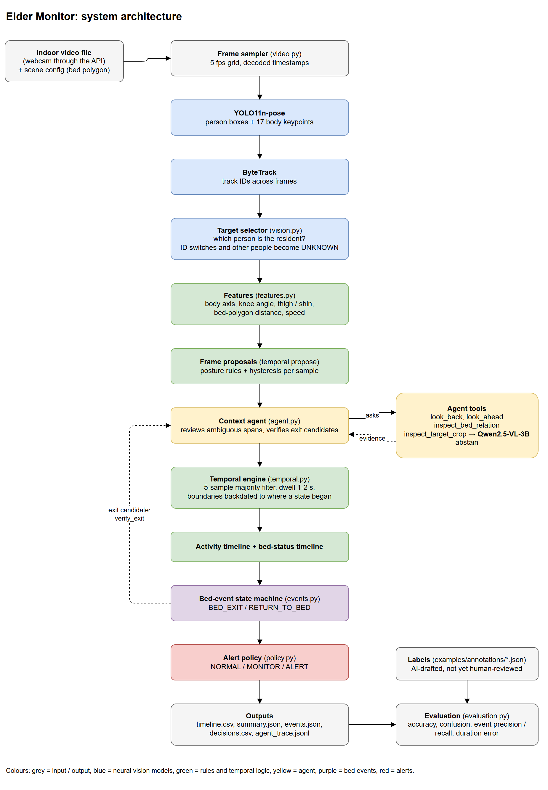

# Elder Monitor — agentic vision prototype for bed-exit monitoring

Analyses a continuous indoor video of one resident and reports what they are doing over time, when they
leave and return to bed, how long each state lasts, and whether anything needs `NORMAL`, `MONITOR` or `ALERT`.

Pretrained pose estimation handles every frame, and explicit temporal logic turns frames into states and
events. A context agent checks every exit candidate and is otherwise invoked only when an observation is
ambiguous. It chooses bounded tools (look back, look ahead, bed-relation geometry, a Qwen2.5-VL check) and
returns evidence that the temporal engine and the bed-event state machine still have to accept.

It is a prototype evaluated on a few minutes of staged stock footage with AI-drafted labels (see
[Example on public footage](#example-on-public-footage)). It has not been validated for clinical use.

## Architecture



Frames flow top to bottom: pretrained vision models first (blue), then explicit rules and temporal logic (green).
The context agent (yellow) is the one loop: it can look back and ahead, check the body against the bed or ask
Qwen2.5-VL, and the bed-event state machine calls it for every exit candidate. The editable source is
[docs/architecture.drawio](docs/architecture.drawio) (open it in [draw.io](https://app.diagrams.net)). This diagram
is the one the assignment brief asks for. More documentation:
[docs/architecture.md](docs/architecture.md) (modules, deployment assumptions), [docs/data.md](docs/data.md)
(inputs, data classes, output fields, time conventions), [docs/uml.md](docs/uml.md) (use-case, activity, sequence,
state, class, component and deployment diagrams, added on request) and
[docs/recording_protocol.md](docs/recording_protocol.md) (what the evaluation data covers, and how to record better).

## Setup

Linux / macOS:

```bash
python -m venv .venv
source .venv/bin/activate
pip install -c constraints.txt -e ".[vlm,dev]"      # drop "vlm" to run geometry-only
```

Windows PowerShell:

```powershell
python -m venv .venv
.venv\Scripts\Activate.ps1
pip install -c constraints.txt -e ".[vlm,dev]"
```

[constraints.txt](constraints.txt) pins every package of a fresh install that passed the whole test suite on
Windows 11 with Python 3.12.0. From PyPI that install gets the CPU build of torch. For an NVIDIA GPU, first install
the CUDA build, which satisfies the same pins:
`pip install torch==2.5.1 torchvision==0.20.1 --index-url https://download.pytorch.org/whl/cu121`.
The reported video runs used torch 2.5.1+cu121, ultralytics 8.4.21, transformers 5.6.1, opencv-python 4.13.0.92,
numpy 2.4.3 and scipy 1.17.1. Each `run_manifest.json` records the versions, the model revisions, the git commit and
whether the working tree had uncommitted changes.

All parameters live in [src/elder_monitor/default.yaml](src/elder_monitor/default.yaml); a scene file only needs the
bed polygon. The merged configuration is checked before any video is read (positive, finite sampling rate; polygons
with at least three normalised points, non-zero area and no self-crossing; target point and time; confidences in
[0, 1]; positive durations; whole-number budgets), and a bad value stops the run with a message naming the key.

### Models, downloads and hardware

| | Download | Memory | Measured speed |
|---|---|---|---|
| `yolo11n-pose.pt` (sha256 `869e83fcdffd…`) + ByteTrack | 6.3 MB, on first use | small | 14 ms per frame on an RTX 4090; 28 ms per frame with PyTorch on the CPU (Ryzen 9 7950X) |
| `Qwen/Qwen2.5-VL-3B-Instruct`, revision `66285546d2b821cf421d4f5eb2576359d3770cd3` (model and processor are both pinned) | 7.0 GiB, the first time the agent needs it | 7.0 GiB of GPU memory at peak (bf16) | about 1.3 s per call on the RTX 4090, after a 17–18 s load; about 15 s per call on the CPU (float32) |

These were measured on one machine (AMD Ryzen 9 7950X, 95 GB RAM, NVIDIA RTX 4090 24 GB, Windows 11). The CPU
figures come from separate runs on the CPU; none of the GPU figures above is a CPU figure. Perception (decoding, pose
model and tracking at 5 fps, model loading included) took 3.8–7.5 s per example clip on the GPU (7–44 s clips); the
rest of the analysis takes milliseconds without the VLM. `--no-vlm` never downloads or loads the VLM.

## Run

```bash
# 1. mark the bed (and chairs), optionally click the resident; writes configs/demo.yaml + a preview png
python -m elder_monitor calibrate --video data/demo.mp4 --output configs/demo.yaml

# 2. analyse
python -m elder_monitor analyze --video data/demo.mp4 --config configs/demo.yaml --output outputs/demo --overlay

# 3. baseline without the context agent, re-using the first run's detections
python -m elder_monitor analyze --video data/demo.mp4 --config configs/demo.yaml --output outputs/demo_baseline \
    --no-agent --observations outputs/demo/observations.jsonl

# 4. evaluate one or more clips against labels (format: annotations/TEMPLATE.json)
python -m elder_monitor evaluate --predictions outputs/demo --annotations annotations/demo.json \
    --output evaluation/demo --videos data/demo.mp4

# reproduce the bundled example on public clips (drop --vlm for geometry-only)
python examples/run_examples.py --vlm

pytest -q
```

Perception (detections, tracking, identity and per-frame bed geometry) is cached in `observations.jsonl`. With
`--reuse` or `--observations`, the cache is used only if its key matches. The key covers the video, the `scene`,
`target`, `sampling`, `vision` and `identity` settings and `posture.speed_window_sec`, the contents of the pose
weights and tracker config, the perception source files (`video.py`, `vision.py`, `features.py`) and the versions of
the libraries that compute keypoints and tracks. Anything else, such as event or policy thresholds, can be changed
without running the detector again. A cache from an older version, or one made with other weights, is never reused.
The manifest's `perception` block names the run that produced reused observations: when, from which commit, with
which weights and library versions. Frames are sampled at 5 fps (or the source rate if lower), using decoded
timestamps.

### Outputs (`outputs/<run>/`)

| File | Contents |
|---|---|
| `timeline.txt`, `timeline.csv` | Activity timeline (`00:00 – 04:32  LYING_IN_BED`) |
| `bed_timeline.csv` | Bed status `IN_BED` / `OUT_OF_BED` / `UNKNOWN` |
| `decisions.csv` | `NORMAL` / `MONITOR` / `ALERT` intervals with reason codes |
| `events.json` | Bed exits / returns (start + confirmation time, states, confidence, decision, evidence), alert episodes, rejected and unresolved candidates |
| `summary.json` | Seconds per state, bed totals, counts, longest continuous out-of-bed period, away episodes, final state, camera-placement check (`view_quality`); a `human` block in `11m 42s` form |
| `agent_trace.jsonl` | Every context request: trigger, tools, windows, findings, outcome |
| `proposals.csv`, `observations.jsonl` | Per-sample proposal and the evidence that sample itself supports; the perception cache |
| `run_manifest.json` | Video hash, config (+hash), model revisions, library versions, git commit and dirty flags, VLM calls; times for perception, analysis, VLM loading and VLM inference; the perception run behind reused observations |
| `overlay.mp4` | Optional visual check of bed region, keypoints, state and decision |

Field meanings and time conventions are in [docs/data.md](docs/data.md). Two definitions matter when reading the
results. An event's `confidence` is a heuristic score, not a calibrated probability.
`longest_out_of_bed_period_sec` is the longest *continuous* labelled out-of-bed span, so it breaks at `UNKNOWN`.
`away_episodes` instead measure each confirmed exit to its return (or the end of the recording), split into observed
out-of-bed time and unknown time.

## API: upload and live webcam

`serve` puts the same pipeline behind a small HTTP + WebSocket API. It is optional; the CLI does everything the
assignment asks. A browser frontend was built for it but is not part of this submission (the brief does not ask for
one); `--frontend <folder>` serves any static frontend at `/`.

```bash
pip install -c constraints.txt -e ".[api]"
python -m elder_monitor serve --config configs/demo.yaml    # API at http://127.0.0.1:8000/api/health
```

| Endpoint | |
|---|---|
| `GET /api/health` | Default bed polygon and sampling fps |
| `POST /api/jobs` | Multipart `file`, optional `bed_polygon` (JSON) and `use_vlm`; returns the job, which runs in the background |
| `GET /api/jobs`, `GET /api/jobs/{id}` | Job list; status, progress and, when done, the result (timelines, events, alerts, chat messages, per-sample poses) |
| `GET /api/jobs/{id}/video` | The uploaded video |
| `WS /api/live` | Send `{"type": "start", "bed_polygon": [...]}`, then JPEG frames as binary messages; each reply has the current state, decision, pose and new chat messages. `{"type": "ask", "text": "..."}` gets an answer |

Controls, all off or local by default so a local demonstration needs no setup:

| Option | Default | Effect |
|---|---|---|
| `--host` | `127.0.0.1` | Binding to another address without an API key prints a warning. |
| `--allow-origin URL` (repeatable) | `http://127.0.0.1:8000`, `http://localhost:8000` | Browser origins allowed by CORS. |
| `--api-key` or `ELDER_MONITOR_API_KEY` | none | Every `/api` request needs the key, as the `X-API-Key` header or `?api_key=` (the WebSocket form). A wrong key gets 401, or a refused WebSocket. |
| `--max-upload-mb` | 500 | Larger uploads get 413 and nothing is kept. |
| `--retention-days` | none | Finished upload jobs older than this are deleted at start-up and when a new job arrives. |

`python -m elder_monitor cleanup --runs runs --older-than-days 7 [--dry-run]` does the same deletion on demand. It
only touches folders the server created (a job-id name with a `job.json`), and never a queued or running job.
Malformed input gets a readable error instead of a closed connection: bad JSON or an unknown message type on the
WebSocket, a frame before `start`, an undecodable image, or a bad bed polygon. There is still no user accounts,
TLS or rate limiting, so keep the server on a trusted network.

**Live mode** runs the offline temporal engine, agent and policy on the webcam stream. It differs from offline
analysis in these ways:
- Frames are timed by when the server receives them, placed on the 5 fps grid. A second frame for a filled slot is
  dropped before the tracker; an empty slot becomes a `no_frame` sample that counts as unobserved. A stream slower
  than the sampling rate therefore leaves the state `UNKNOWN` more often, and `view_quality.degraded` is set once a
  quarter of the slots are empty. Lower `sampling.fps` for a slow camera.
- The VLM is not used live, so the agent has only its geometry and temporal tools.
- Candidates are confirmed only once the confirming frames have arrived (about 2 s of walking or distance from the
  bed, or 1 s out of view after walking).
- Each kept frame re-analyses a bounded window. At quiet moments (one committed state for a while, no exit or
  return candidate open, not lying outside the bed), everything older is archived. The state machine and policy
  timers carry over, so totals, event counts, episode numbers and timers continue, and each event is announced once.
  `tests/test_live.py` checks that a scripted session with 11 checkpoints gives exactly the offline result.
- Measured analysis time per frame, on scripted observations (pose model not included), on the Ryzen 9 7950X:

  | Session length | Re-analysing the whole history (old behaviour) | Bounded window (now), mean / 95th percentile |
  |---|---|---|
  | 10 min | 29 ms | 5.7 / 11.4 ms |
  | 30 min | 103 ms | 5.6 / 9.9 ms |
  | 60 min | 219 ms | 6.0 / 11.7 ms |
  | 120 min | 564 ms | 5.9 / 11.7 ms |

  The window never held more than 1063 samples (213 s) in the 2-hour run. Add about 14 ms per frame for the pose
  model on the GPU. Without a quiet stretch (for example continuous walking about) the window keeps growing until one
  comes.

Uploads and results are kept in `runs/<id>/` (the usual output files plus `result.json`) until deleted. Browsers
only allow the camera on `localhost` or HTTPS. The TestClient-based API tests passed with the pinned FastAPI 0.135.1 /
Starlette 1.3.1 / httpx 0.28.1, and a minimal TestClient test also passed with FastAPI 0.142.2 / Starlette 1.7.0 /
anyio 4.15.1, with either httpx or httpx2. A hang reported in another environment was not reproduced.

## States

Two timelines are kept. **Activity** has exactly one label at a time; **bed status** is derived from it.
Both are gap-free half-open intervals covering `[0, T)`, so each sums exactly to the video length.

| Activity | Evidence | Bed status |
|---|---|---|
| `LYING_IN_BED` | body axis ≥ 60° from vertical (leave below 45°) with hips / body on the bed polygon | IN_BED |
| `SITTING_ON_BED` | upright with hips on the bed; legs seated, hidden, or stretched out on the mattress | IN_BED |
| `SITTING_OUTSIDE_BED` | upright with seated legs or hips in a chair polygon, outside the bed | OUT_OF_BED |
| `STANDING` | upright, extended legs, feet off the mattress, little movement | OUT_OF_BED |
| `WALKING` | upright and moving ≥ 0.5 torso lengths/s (leave below 0.3) | OUT_OF_BED |
| `OUT_OF_BED` | outside the bed but the finer posture is unresolved (coarse fallback) | OUT_OF_BED |
| `LYING_ON_FLOOR` | lying outside the bed polygon; added because it drives the most important alert | OUT_OF_BED |
| `UNKNOWN` | not detected, too few keypoints, identity uncertain, or posture unclear | UNKNOWN |

Per-frame cues come from the 17 COCO keypoints. The body axis is shoulder-to-hip, or hip-to-ankle when the
shoulders are out of frame. A short torso relative to shoulder width on the bed (legs hidden) means lying along
the camera axis. Legs are seated when the knee angle is < 140° (side view) or the thigh is foreshortened relative
to the shin (< 0.72, thigh pointing at the camera), with knee drop or thigh angle as fall-backs when the ankles
are hidden. Straight legs only mean standing when they are roughly vertical, and seated legs within the edge margin of
the bed outline count as sitting on the bed. The box aspect is only used when no body axis is measurable and the box is
not cut by the frame edge; hips over the bed with no measurable posture stay `UNKNOWN`. When the joints drop out right
after standing or walking (someone walking past the lens), the tracked box keeps the label `WALKING` while it moves at
walking speed without changing shape.

Temporal handling: a centred 5-sample majority filter, then a state is committed only after it persists for its
dwell time (1 s; 2 s for `UNKNOWN` and `LYING_ON_FLOOR`) and the boundary is backdated to where it began. If
labels keep alternating so that none can settle, the latest one is committed after 4 s rather than keeping a stale
state. Short dropouts are absorbed; gaps longer than 2 s become `UNKNOWN` instead of being forced into a class.
`UNKNOWN` straight after `WALKING` that lasts to the end of the recording (walked out of view) commits after 1 s.

## Bed exit and return

A state machine runs over the committed timelines:
`UNINITIALIZED → IN_BED_BASELINE → EXIT_PENDING → AWAY_EPISODE → RETURN_PENDING → IN_BED_BASELINE`.

The committed timeline decides the modes; the timers use **evidence**, which is what each sample itself shows. That is
its own rule proposal, an explicit agent re-read of an observed posture, or a VLM answer about that very frame, and
`UNKNOWN` where nothing was observed. A gap the agent bridged, a label the majority filter smoothed and a missing
frame all add nothing to a timer. Evidence is counted in slots of the 5 fps grid, so duplicate frames add nothing.

- **Candidate**: from an in-bed baseline the bed status turns `OUT_OF_BED` (this is the exit `start_time`).
- **BED_EXIT confirmed** (`confirmed_time`) when the resident has moved away:
  - observed walking or beyond the near-bed band (bed polygon + 0.08·H) for 2 s;
  - or walking and then out of view for 1 s without getting back into bed;
  - or 30 s of observed out-of-bed samples, even beside the bed (a bedside chair).

  Standing still beside the bed resets the count, and unseen time only pauses it. "Out of view" means nobody is
  confidently detected. A confident person who cannot be confirmed as the resident (a caregiver in front), a tracked
  box with lost joints and missing frames only pause the count. A tracked box still moving at walking speed when the
  joints drop out counts as walking if the resident is then lost from view. An exit is emitted once per episode, with
  the agent's evidence attached.
- **Not an exit**: sitting up, turning, edge-sitting, or standing next to the bed and sitting back down (the
  candidate is rejected when bed status returns to `IN_BED` before departure).
- **RETURN_TO_BED**: after an away episode the resident re-occupies the bed (occurrence time), then 2 s of lying must
  be *seen* without a break (confirmation). `UNKNOWN`, another state or a missing frame restarts that count, but the
  occurrence time is kept. A brief stand in between (no departure, under 30 s) keeps the first sit-down as the
  occurrence time. `events.return_rule: sitting` switches to the looser rule: any in-bed state for 2 s without a
  break.
- A video that starts outside the bed opens an away episode without an exit. Candidates still pending at the end
  of the video are reported as unresolved and not counted.

Annotation policy to match: exit time = the moment the resident stands up off the bed; return time = the moment
they sit back on it.

## Agent

The agent is deterministic and budgeted. It decides *whether* more context is needed and *which* tool to use next,
and stops as soon as the evidence is sufficient.

| Trigger | Raised when | Tool sequence |
|---|---|---|
| `EXIT_CANDIDATE` | bed status turns `OUT_OF_BED` from the in-bed baseline | `look_back` for the majority state before (8 s, then 16 s) → `look_ahead` departure check over 8 s, extended once; still unresolved → re-checked later with a new window. One trace record per candidate with the final outcome |
| `LYING_OUTSIDE_BED` | ≥ 2 s lying with hips outside the bed polygon | `inspect_bed_relation`; under a quarter of the keypoints on the mattress → floor (fail-safe). Otherwise `inspect_target_crop` (VLM bed / floor) → `look_back` (came from lying in bed → bed), otherwise floor. Samples fully off the mattress always stay floor |
| `AMBIGUOUS_GAP` | ≥ 2 s of `UNKNOWN` proposals | `look_back` + `look_ahead` for the states right next to the gap. In bed on both sides and either lying on both sides (blanket) or an unconfirmed person (caregiver in front), ≤ 30 s → bridge the *timeline* (not the evidence). Otherwise the VLM checks 3 frames across the gap and must agree (not for an identity conflict outside the bed). Only samples where the resident is identified are sent and relabelled; others stay `UNKNOWN`. Resident last seen leaving the frame and no longer detected, or no agreement → `abstain` (stays `UNKNOWN`) |
| `UPRIGHT_ON_BED_REGION` | 1–30 s of `STANDING` with the hips over the bed in ≥ 80% of samples, never at walking speed, with `SITTING_ON_BED` before and after (≥ 1 s after) | `inspect_bed_relation` → `look_back` + `look_ahead` → the VLM checks 3 frames; all three "sitting on the bed" → `SITTING_ON_BED` (edge-sitting facing the camera, where seated legs look straight), otherwise `STANDING` is kept. Only with a VLM |

The VLM is only asked about a sample where the resident is identified. That means the selected resident's own tracked
box (visible, or with too few joints), or the bed region when nobody at all is detected. The crop is outlined in
green around that box, and the prompt asks only about the person inside the green box. Before the resident is selected
(`target_not_selected`), or while an unconfirmed person is in view (`identity_uncertain`, `low_confidence`), a
sample is never sent and never relabelled. Three agreeing answers relabel the identified samples of a gap in the
timeline, but count as evidence only for the three frames the VLM looked at.

Budgets: two context rounds per trigger, three VLM frames per trigger, 60 VLM calls per run. VLM replies must be
valid JSON with allowed values; rejected replies are logged raw. A failed VLM load or call falls back to geometry.
Real trace from `examples/outputs/pexels_4052924/agent_trace.jsonl` (the man gets out of bed at 23 s):

```json
{"trigger": "EXIT_CANDIDATE", "window": [23.4, 25.6],
 "steps": [{"action": "look_back", "window": [15.4, 23.4],
            "finding": {"label": "SITTING_ON_BED", "share": 0.95, "seconds_before": 0.6}},
           {"action": "look_ahead", "window": [23.4, 27.88],
            "finding": "walks away from the bed; departure confirmed at 25.6s"}],
 "outcome": "BED_EXIT confirmed"}
```

For an exit the look-back reports the window's majority state (was the resident in bed?); for gaps and lying outside
the bed it reports the state right next to the event.

## Alert rules

Evaluated on every sample; `ALERT` outranks `MONITOR` outranks `NORMAL`. Each rule episode is recorded once with its
start and end. The thresholds are demonstration values, not clinical cut-offs.

| Decision | Rule | Why |
|---|---|---|
| ALERT | `LYING_ON_FLOOR` — committed lying outside the bed | possible fall; the one case that should never wait |
| ALERT | `PROLONGED_OUT_OF_BED` — committed out of bed without a break for > 300 s (reset by bed or `UNKNOWN`; a dropout shorter than the 2 s `UNKNOWN` dwell does not reset it) | unexpected long absence while in view |
| ALERT | `ABSENT_FROM_BED_LONG` — > 900 s since the resident was seen leaving the bed, whether visible or not; never while in bed | covers getting up and leaving the camera view |
| MONITOR | `EDGE_SIT_LONG` — sitting on the bed > 60 s and on the edge for at least half of the last 60 s | common precursor to an unassisted exit |
| MONITOR | `EVENT_PENDING` — exit candidate not yet confirmed or rejected | someone is up; watch until resolved |
| MONITOR | `UNCERTAIN` — activity `UNKNOWN` | the system cannot vouch for the resident |
| NORMAL | none of the above | ordinary lying, sitting, standing, walking |

A confirmed `bed_exit` carries at least `MONITOR`, escalating to `ALERT` if an alert rule is active when it is confirmed.

## Evaluation

`evaluate` compares exported predictions with interval labels on a 0.1 s grid. Both are checked first: known labels,
finite, ordered intervals from 0 with no gap or overlap, and valid events. The prediction must cover the labelled
duration to within 0.05 s, which absorbs the 2-decimal rounding of the CSV files. A truncated or mismatched run is
rejected with an error rather than scored on the overlap, so no labelled time or event is silently dropped.
Durations come from the timelines themselves, not from rounded summary values. It reports:

- activity and bed-status accuracy (UNKNOWN included), per-class precision / recall / F1 and macro F1 (classes present
  in the labels plus wrongly predicted known classes; abstention is reported as `predicted_unknown_share`), confusion
  matrix in seconds + png;
- bed exits and returns matched one-to-one on occurrence time within ±2 s (maximum matching): TP / FP / FN, precision,
  recall, false exits per hour, time error, confirmation delay. A missed event labelled less than 3 s before the end
  of its clip is also counted as `missed_with_short_context`, because the recording stops before a confirmation is
  possible. That count is extra information; the strict TP / FP / FN stay as they are;
- predicted vs. true seconds per state (signed and absolute error, macro mean) and per bed status. Totals over
  several clips can hide errors that cancel, so `metrics.json` also gives, per state, the summed per-clip absolute
  error next to the totals;
- `failure_candidates.csv` and `failure_cases.md`: every false / missed event plus the longest wrong-state spans,
  with snapshot frames when `--videos` is given, ready for cause / fix notes.

Tune on development clips, freeze the config, then evaluate held-out clips; compare against `--no-agent` to see what
context review buys. The labels shipped with the examples are AI-assisted drafts that no person has reviewed yet;
[examples/annotations/REVIEW.md](examples/annotations/REVIEW.md) is the review log, and `tests/test_annotations.py`
checks only that the files are well formed.

## Example on public footage

`python examples/run_examples.py --vlm` runs the system on six short Pexels clips (free licence, downloaded by the
script) plus one constructed clip, with and without the agent. The constructed clip is `pexels_4049556` forwards, 5 s
of the empty room, then the same footage reversed, so its "return" is the exit played backwards. Four clips have
draft labels (97.25 s). `--heldout` runs 13 other clips (278.66 s):

| Run | Activity accuracy | Bed-status accuracy | Bed exits (±2 s) | Returns (±2 s) | Duration error |
|---|---|---|---|---|---|
| Development, full system (VLM) | 0.902 (macro-F1 0.801) | 0.932 | 4 / 4 found, 0 false, 0.47 s timing error | 1 / 1, 0.66 s timing error | 0.66 s per state |
| Development, `--no-agent` | 0.826 (macro-F1 0.736) | 0.856 | same | same | 1.46 s per state |
| Held-out, full system (VLM) | 0.667 (macro-F1 0.504) | 0.836 | 1 / 3 found, 0 false | 1 / 3 found, 0 false | 2.84 s per state |
| Held-out, `--no-agent` | 0.502 (macro-F1 0.438) | 0.670 | 1 / 3 found, 0 false | 1 / 3 found, 0 false | 5.06 s per state |

Every row comes from a fresh run of the current code on 2026-09-30: new pose inference, tracking, agent and VLM calls,
then evaluation. The code was commit `4a1a280` plus the uncommitted changes of this review, which the manifests record
as `src_dirty`. The no-agent rows reuse the same run's observations, so both columns share one perception. Every clip is scored over its whole labelled length.
One held-out exit is labelled 0.7 s before its clip ends and is also counted as `missed_with_short_context`.

The held-out clips were never used to tune thresholds. Their labels were drafted blind, before the system was run on
them, by two independent AI annotators, and have not yet been reviewed by a person. Zero false exits, false returns and
ALERTs were observed on them, in 4.6 minutes of footage with 6 labelled events; that is far too little to estimate a
false-alarm rate. The four missed events, from their frames, detections and traces
([examples/README.md](examples/README.md#why-four-held-out-events-were-missed)):
- a caregiver-assisted exit where the resident left at the frame border, only weakly detected, with her hips inside
  the bed outline until she was out of view;
- two returns (one action filmed from two cameras) where the footboard and clothes on it hide the lying body and
  the detector loses him;
- a clip that ends 0.7 s after the stand-up.

The first held-out run (commit `e1c709a`) scored higher: activity 0.724, bed status 0.940, 2 of 3 returns. Part of
that came from VLM answers about samples where the resident had not been identified, which a later review removed
([examples/FAILURE_CASES.md](examples/FAILURE_CASES.md)). Fixes were checked on the development clips only.

On the development clips the agent's gain comes from its VLM check of edge-sitting facing the camera, which the leg
rules read as standing (8.6 s → 1.2 s of that confusion). On the held-out clips it comes from VLM checks of close-ups
where the rules had too few joints of the identified resident. Per-state durations, the confusion matrix, the
agent-vs-baseline comparison and the failure cases (with their fixes, before / after numbers and what is still open)
are in [examples/README.md](examples/README.md) and [examples/FAILURE_CASES.md](examples/FAILURE_CASES.md). The
development clips were also used while fixing bugs, so their numbers are not a held-out result; the held-out rows are
the better estimate for a new camera. All clips are staged by adult actors and are 7–44 s long. Neither set
establishes performance on elderly residents, overnight reliability, or clinical safety.

## Camera and scene assumptions

- **Fixed camera.** The bed polygon is drawn once on the camera's view. A handheld or moved camera, or a moved bed,
  invalidates it; recalibrate.
- **Calibrated bed polygon.** It should cover the visible mattress. Everything "in bed" is decided in 2D against it.
- **Body visibility.** The rules need the resident's body joints. Blankets, furniture, the frame border and
  darkness remove joints and lower detection confidence; the system then reports `UNKNOWN` or keeps the last state
  instead of guessing. `view_quality` warns when a quarter of the detected samples have too few joints.
- **2D geometry.** A person standing in front of or behind the bed can have their hips inside the bed outline in the
  image; walking and leaving the view help, but depth is not measured.
- **Appearance matching.** Identity rests on track IDs, position and a colour histogram. That is weak evidence:
  similar clothing, dim light or two people swapping places close together can still confuse it, and the system
  prefers `UNKNOWN` to adopting someone else.

## Models

- **YOLO11n-pose**: a CSP-style convolutional backbone and neck produce multi-scale feature maps, and an anchor-free
  head predicts person boxes and 17 COCO keypoints with confidences. It knows nothing about beds or the activity
  labels; that comes from the geometry and temporal logic.
- **ByteTrack**: Kalman-filter motion prediction with two-stage IoU association (high-confidence boxes first, then
  low-confidence ones, which is why detections are kept down to 0.1), so partially occluded people keep their track.
  Track IDs are not identities. `TargetSelector` keeps the resident separately:
  - Other confident people tracked alongside the resident are remembered, with their appearance, and their IDs are
    not re-attached as the resident. The tracker can later give such an ID to the resident (it re-activates a lost
    track on them), so the ID becomes usable again only for a box that looks clearly more like the resident than like
    the person last seen with it. Duplicate boxes on the resident's own body (matched by keypoints) are not
    remembered.
  - A box that keeps the resident's track ID must still be within reach of the last position (0.25·H plus 0.5·H per
    second since last seen). It must also keep an HSV appearance similarity of at least 0.3. Otherwise the ID switch
    becomes `identity_uncertain` instead of a new resident. On the development clips, the 481 genuine continuations
    used at most 0.68 of the allowed distance, and their lowest similarity was 0.52.
  - A lost resident is re-attached only by a confident detection whose appearance clearly beats every other candidate
    nearby. Otherwise the frame is `UNKNOWN`: `identity_uncertain` when a confident unconfirmed person is in view, and
    `low_confidence` when only weak boxes are.
  - A low-confidence continuation of the track that jumps from outside the bed into it is rejected. Detections mostly
    inside `scene.ignore_polygons` (mirrors, TV screens) are dropped unless they are the tracked resident.

  These are heuristics, not a guarantee.
- **Qwen2.5-VL-3B-Instruct**: a ViT with window attention encodes the selected crop into visual tokens that the
  Qwen2.5 language model attends to, answering a constrained JSON question about posture and supporting surface.
  It runs only on crops the agent selects; the model and processor are loaded at the pinned revision.
- **Temporal engine / FSM / policy**: explicit, testable logic rather than a trained network.

References:
- G. Jocher and J. Qiu, *Ultralytics YOLO11*, version 11.0.0, 2024 (software). Model documentation:
  https://docs.ultralytics.com/models/yolo11/
- Y. Zhang et al., "ByteTrack: Multi-Object Tracking by Associating Every Detection Box", 2021 (revised 2022),
  arXiv:2110.06864.
- S. Bai et al., "Qwen2.5-VL Technical Report", 2025, arXiv:2502.13923.

## Difficult cases

"Real clips" means the case appears in labelled or unlabelled example footage; the rest is covered only by scripted
scenario tests ([docs/recording_protocol.md](docs/recording_protocol.md) maps each case to its clips and tests).

| Case | Handling | Real clips |
|---|---|---|
| Turning in bed | lying hysteresis (enter 60°, leave 45°) + dwell; no exit without leaving the bed | none |
| Sitting up / edge-sitting | `SITTING_ON_BED`, bed status stays `IN_BED`; `EDGE_SIT_LONG` after 60 s on the edge | yes (under 60 s) |
| Standing briefly then sitting back | exit candidate rejected when bed status returns to `IN_BED` before departure | none |
| Leaving / returning | one exit and one return per episode, occurrence and confirmation times kept separately | yes |
| Sitting on a chair | chair polygons or seated-leg geometry outside the bed; 30 s observed beside the bed confirms the exit | none |
| Walking around | anchor speed over a 1 s window with hysteresis | walking in and out only |
| Blankets / temporary occlusion | short gaps between lying-in-bed spans are bridged in the timeline; timers wait for real observations | yes |
| Caregiver enters | co-tracked people are not re-attached as the resident; a same-ID box that jumps or looks different is refused; an ID seen on a caregiver is re-attached only with clearly resident-like appearance; conflicts become `UNKNOWN` and do not count as leaving the view; the VLM is never asked about those samples | yes |
| Poor lighting | low keypoint confidence → `UNKNOWN` instead of a forced class | yes (dim, handheld) |
| Leaves camera view | `UNKNOWN`; an exit is still confirmed if they were walking when last seen and nobody is then confidently detected; `ABSENT_FROM_BED_LONG` after 15 min | yes (short absences only) |
| Lying outside the bed | `LYING_ON_FLOOR` → ALERT; lying at the bed outline goes to the agent | none |
| Edge-sitting facing the camera | seated legs can look straight; the agent's `UPRIGHT_ON_BED_REGION` check asks the VLM before relabelling | yes |
| Walking out past the lens | the moving box of the tracked resident keeps `WALKING` when the joints drop out | yes |
| Mirror or TV in view | `scene.ignore_polygons`; the resident is never dropped | yes |
| Camera too close / body cut off | `summary.json` `view_quality.degraded` and a CLI warning when ≥ 25% of the detected samples have too few joints | yes |

## Licences

The example videos are from [Pexels](https://www.pexels.com/license/) and are downloaded by the scripts, not stored in
the repo. YOLO11-pose (Ultralytics) is AGPL-3.0, and Qwen2.5-VL-3B-Instruct is under the Qwen Research License; check
both before any commercial use.

## Limitations and next steps

- The evaluation is small: 4.6 minutes of held-out footage with 6 events, two of them one action seen from two
  cameras, and AI-drafted labels that no person has reviewed. A recording and annotation protocol for better data is
  in [docs/recording_protocol.md](docs/recording_protocol.md); it needs real recordings.
- Posture thresholds are geometric heuristics and need tuning per camera angle. With a camera facing the bed, seated
  legs pointing at the lens look straight, so edge-sitting can read as standing. The agent fixes this with a VLM check;
  without the VLM the error remains (examples/FAILURE_CASES.md, case 1). The fixes for the example failures were tuned
  on the same development clips.
- A 2D bed polygon cannot separate "on the bed" from "in front of or behind the bed". Walking and leaving the view
  help with exits; a depth cue or a floor-plane model would be more robust.
- The resident is lost when furniture or the frame border hides most of the body, or when only weak detections
  remain; the system then says `UNKNOWN` instead of guessing, and events in those spans are missed.
- The HSV appearance model is weak in the dark or when clothing matches the caregiver's; a ReID embedding would help.
- If the resident walks out of view while a caregiver stays confidently in view, the exit is not confirmed by the
  walk-out rule (it only counts time with nobody confidently detected). It needs the caregiver to leave too, or ends
  unresolved.
- Requiring observed evidence makes confirmations later when detections flicker: one held-out return is now confirmed
  3.8 s after it starts instead of 1.8 s.
- Live mode has no VLM and no user management; its bounded window only helps once a quiet stretch occurs.
- With more time: learn the frame classifier from short keypoint sequences (a small temporal CNN / GRU), calibrate the
  event confidence on validation data, record longer staged sessions for a proper held-out test set, and try the VLM
  as the agent's planner.
