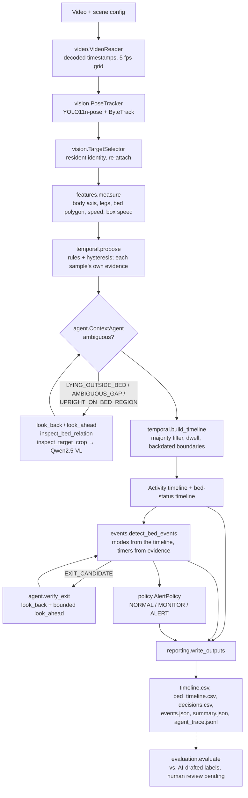

# Architecture

The assignment brief asks for a simple architecture diagram: [architecture.png](architecture.png) (source
[architecture.drawio](architecture.drawio)) in the README. This page lists the modules behind it. The UML diagrams
in [uml.md](uml.md) were added on request, and [data.md](data.md) describes the inputs, data classes, outputs and
time conventions.

| Module | Responsibility |
|---|---|
| `schemas.py` | State names, bed status mapping, dataclasses (Observation, Proposal, Segment, BedEvent, Verdict) |
| `config.py` | Default + scene YAML merge, validation of every setting before a run, hashing |
| `video.py` | Timestamp-aware sampling on a fixed grid, frame seek for context, file hash |
| `vision.py` | YOLO11-pose + ByteTrack wrapper; resident selection, re-association, same-ID consistency check and revalidation of IDs last seen on other people; ignore polygons |
| `features.py` | Scene geometry and raw per-frame posture / bed evidence, keypoint and box speed |
| `temporal.py` | Frame proposals (box motion when the joints drop out), smoothing, dwell / hysteresis, committed timelines |
| `agent.py` | Trigger handling, bounded tool selection, evidence trace, exit verification; keeps the per-sample evidence separate from bridged proposals |
| `vlm.py` | Qwen2.5-VL adapter pinned to one model revision, validated JSON answers |
| `events.py` | Departure guard and bed exit / return state machine; timers count observed evidence on the sampling grid |
| `policy.py` | Explicit alert rules, decision timeline, one record per rule episode |
| `reporting.py` | CSV / JSON outputs, summary (including away episodes), overlay video, observation cache |
| `evaluation.py` | Input and coverage checks, accuracy, confusion, event precision / recall, duration error, failure cases |
| `pipeline.py` | Wires the stages; `run_analysis` is the testable core after perception; perception cache key and provenance; camera-placement check |
| `calibrate.py`, `cli.py` | Bed / chair polygon tool and the command-line entry points (`calibrate`, `analyze`, `evaluate`, `serve`, `cleanup`) |
| `live.py` | Webcam session: resamples arriving frames onto the sampling grid and analyses a bounded window that resumes from checkpoints; chat messages, status answers |
| `server.py` | FastAPI app: upload jobs, results, video, live WebSocket; allowed origins, optional API key, upload limit, opt-in retention |

Data flows one way. Labels are only read by `evaluation.py`. The VLM never writes the timeline directly: its answers
become proposals that still pass the temporal engine, only for samples where the resident is identified, and they
count as evidence only for the frames it actually looked at.

## Deployment assumptions

- One machine runs everything: the CLI, or the optional FastAPI server, which binds to `127.0.0.1` by default.
  There is no database, queue or cloud service; results are files under `outputs/` or `runs/`.
- A GPU is optional. It is needed for the VLM at a usable speed.
- The camera is fixed and calibrated once: the bed polygon is drawn on its view. Moving the camera or the bed means
  drawing the polygon again.
- The resident should be visible for most of the time. When they are not, the system reports `UNKNOWN` rather
  than guessing; see "Camera and scene assumptions" in the README.
