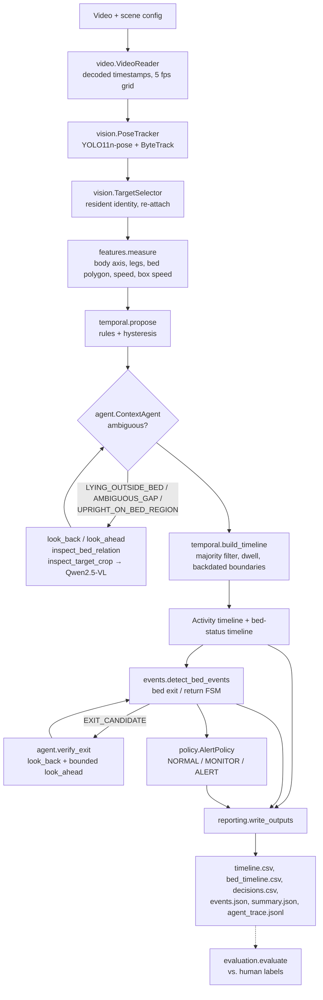

# Architecture

| Module | Responsibility |
|---|---|
| `schemas.py` | State names, bed status mapping, dataclasses (Observation, Proposal, Segment, BedEvent, Verdict) |
| `config.py` | Default + scene YAML merge, validation, hashing |
| `video.py` | Timestamp-aware sampling on a fixed grid, frame seek for context, file hash |
| `vision.py` | YOLO11-pose + ByteTrack wrapper, resident selection and re-association, ignore polygons |
| `features.py` | Scene geometry and raw per-frame posture / bed evidence, keypoint and box speed |
| `temporal.py` | Frame proposals (box motion when the joints drop out), smoothing, dwell / hysteresis, committed timelines |
| `agent.py` | Trigger handling, bounded tool selection, evidence trace, exit verification |
| `vlm.py` | Qwen2.5-VL adapter with validated JSON answers |
| `events.py` | Departure guard and bed exit / return state machine |
| `policy.py` | Explicit alert rules, decision timeline, one record per rule episode |
| `reporting.py` | CSV / JSON outputs, summary, overlay video |
| `evaluation.py` | Accuracy, confusion, event precision / recall, duration error, failure cases |
| `pipeline.py` | Wires the stages; `run_analysis` is the testable core after perception; camera-placement check |
| `calibrate.py`, `cli.py` | Bed / chair polygon tool and the command-line entry points |
| `live.py` | Webcam session that re-runs `run_analysis` on every frame, chat messages, status answers |
| `server.py` | FastAPI app: upload jobs, results, video, live WebSocket; optionally serves the web frontend |

Data flows one way. Ground-truth labels are only read by `evaluation.py`.
The VLM never writes the timeline directly: its answers become proposals that still pass the temporal engine.
