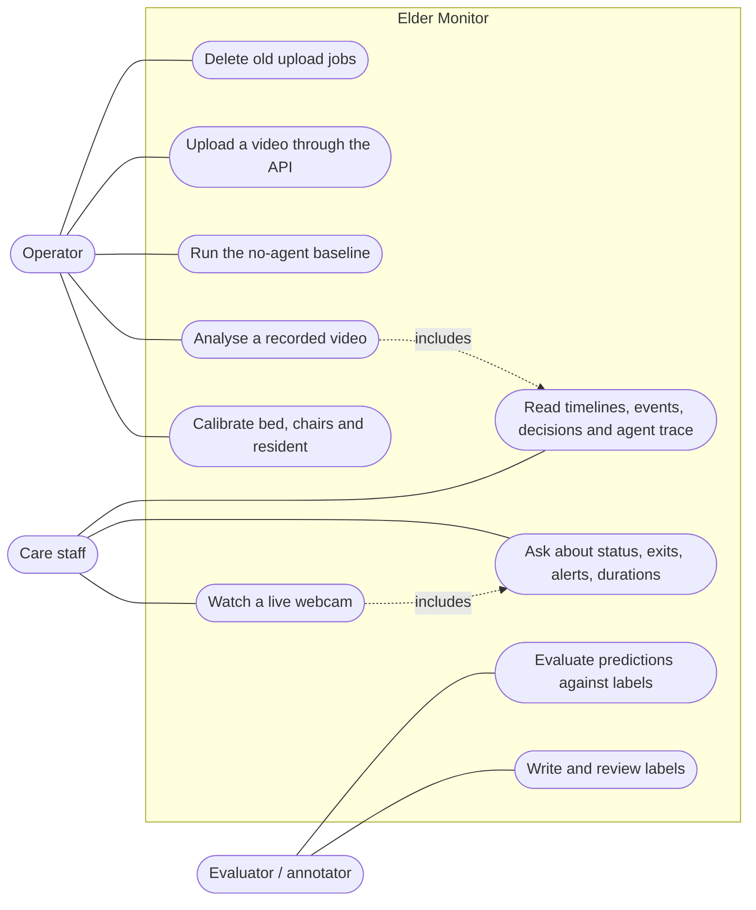
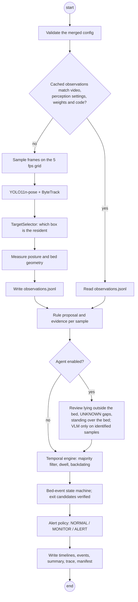
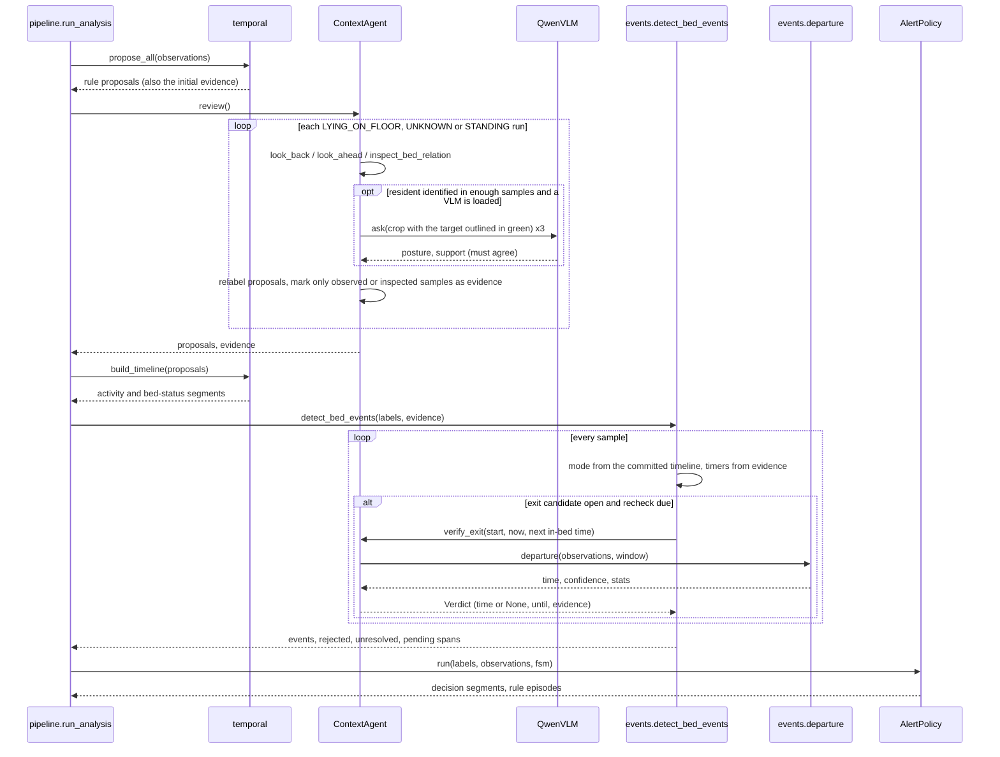
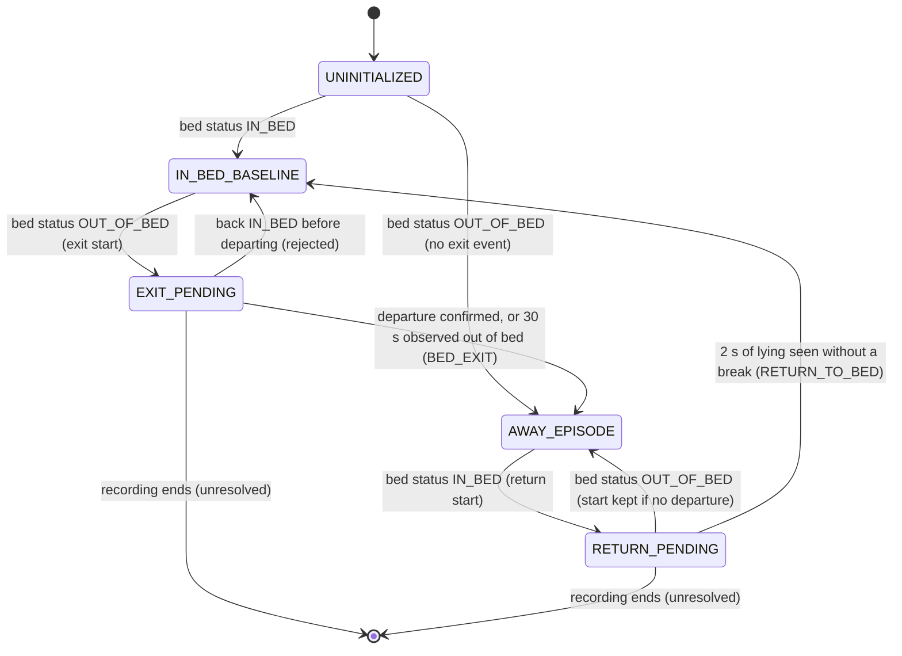
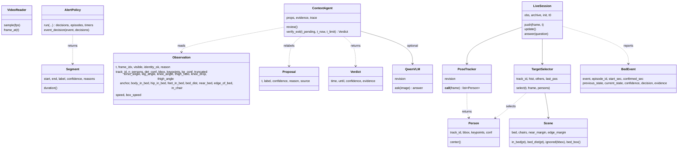
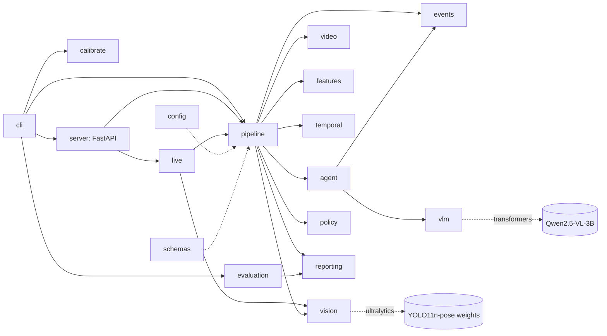
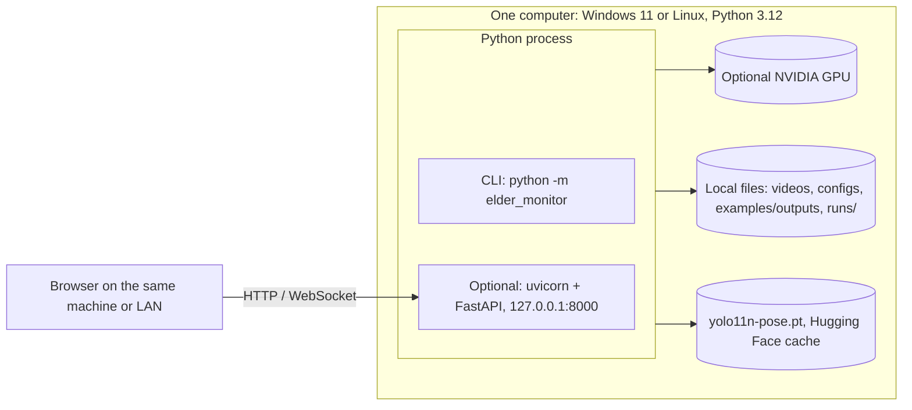

# UML diagrams

The assignment brief asks for one simple architecture diagram, which is [architecture.png](architecture.png) in the
README. The diagrams below were added on request, to document behaviour and structure in more detail. They are
drawn from the code as it stands; each one names the module it describes. They are Mermaid sources, so GitHub renders
them and they can be edited as text.

Mermaid has no dedicated use-case or deployment diagram, so those two are flowcharts that follow the UML notation:
actors outside the system boundary, use cases as rounded nodes, nodes and artefacts as boxes.

## Use cases

## Activity: analysing a recorded video (`pipeline.analyze`)

## Sequence: analysis and exit verification (`pipeline.run_analysis`)

## State machine: bed events (`events.detect_bed_events`)

Transitions follow the committed bed status. The two timers (observed out-of-bed time for the dwell fallback, and
the continuous supported lying that confirms a return) count evidence only.

## Classes and data

`pipeline.run_analysis`, `temporal.build_timeline` and `events.detect_bed_events` are functions rather than
classes; they turn `Observation`s into `Proposal`s, `Segment`s and `BedEvent`s.

## Components (`src/elder_monitor`)

## Deployment

There is no database, message queue or cloud service. Upload jobs, results and live sessions stay on the host;
live sessions are held in memory only.
