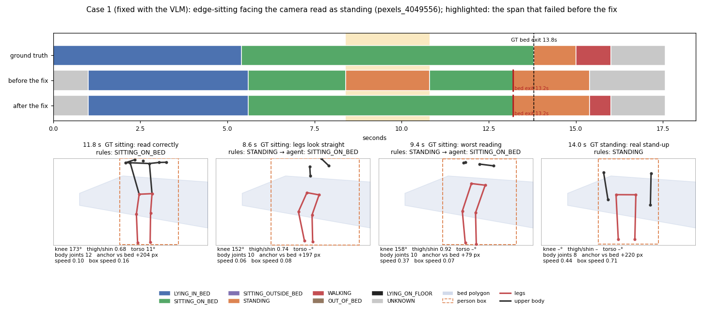
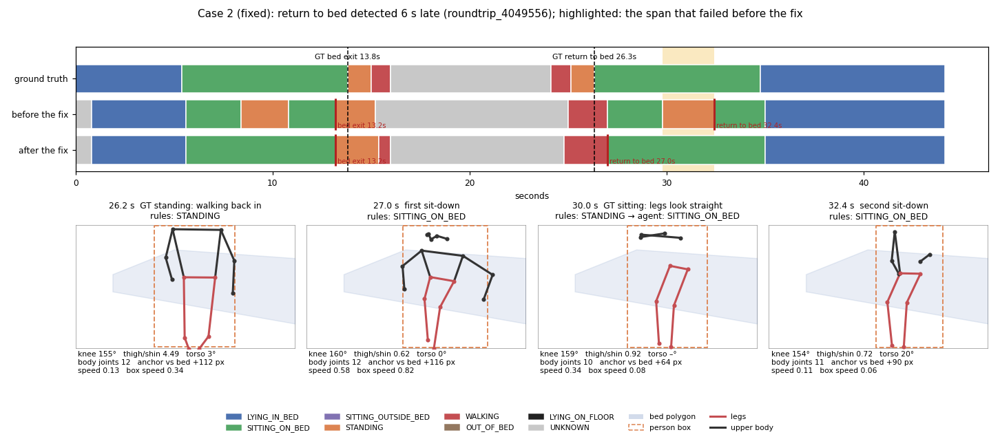
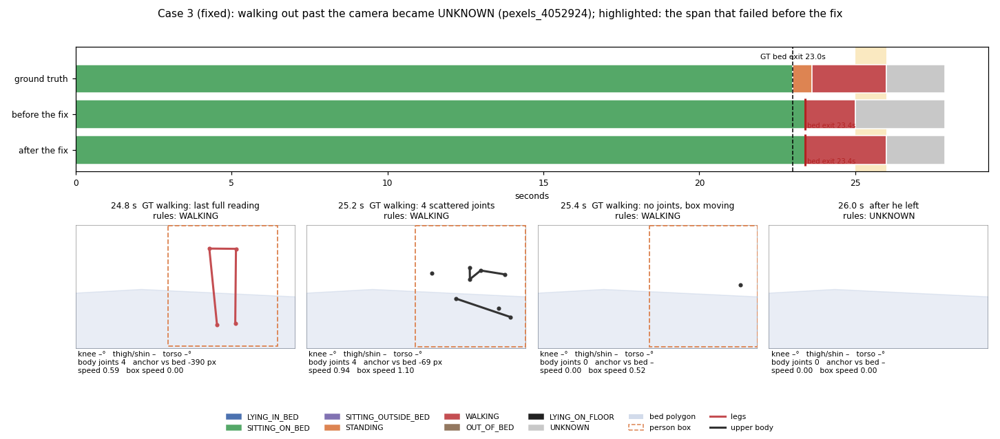
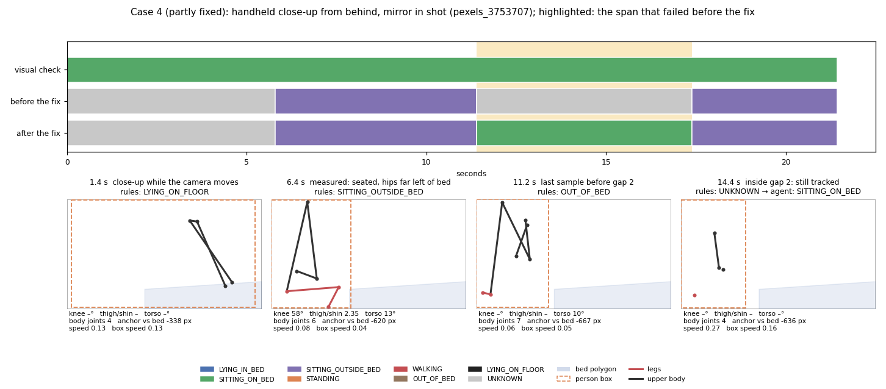

# Failure cases

These are real failures from running the system on the example clips (`python examples/run_examples.py --vlm`).
Cases 1–4 were open in the previous version; they are now fixed in the code (case 4 only partly, because its root cause
is the camera placement). For each case you get:
- what went wrong, and where in the pipeline, with the measured values;
- the fix and where it lives in the code;
- the regression tests (`tests/test_failure_cases.py`);
- the numbers before and after;
- what is still open.

Case 5 lists failures fixed earlier during development on the same footage.

**About the numbers.** "Before" is the previous code, "after" the current code, both on the same cached keypoints
(`figures/before_fix.json` keeps the earlier timelines). They are measured on the same four labelled development clips
that exposed the failures, and the labels were drafted by one annotator (about ±0.3 s). So they show that each fix works
and costs nothing elsewhere on this footage; they are not held-out performance.

**How to read the figures** (`figures/`, drawn by `make_figures.py` from the cached keypoints, no video frames):
- The top strip compares the ground truth (for the unlabelled case 4, a visual check) with the timeline before and after
  the fix; the span that failed before is highlighted.
- Dashed black lines mark ground-truth events; solid red lines mark predicted event starts.
- Each panel below is one sample at the video's resolution: keypoints with confidence ≥ 0.3 (legs in red; face points
  are drawn but not counted as body joints), the person box (dashed orange) and the bed polygon (blue).
- The panel title gives the rule proposal, and "→ agent: X" when the agent changed it. The text under it gives the
  values the rules use. "Anchor vs bed" is the signed distance from the hip midpoint to the bed polygon (positive =
  inside), or from the box centre when no hip is detected. "Box speed" is the box-centre speed used when joints drop out.

## Summary

| # | Clip | Failure | Root cause | Fix | Status |
|---|---|---|---|---|---|
| 1 | `pexels_4049556`, round trip | 2.4–2.6 s of edge-sitting reported as STANDING | From a camera in front and above, seated legs look straight | Agent trigger `UPRIGHT_ON_BED_REGION`: a still, short stand over the bed between two sits goes to the VLM | Fixed **with the VLM**; unchanged without it |
| 2 | round trip | Return to bed reported 6 s late | Case 1 interrupted the return, and the state machine threw away the first sit-down | Keep the first sit-down when nothing in between counts as leaving | Fixed |
| 3 | `pexels_4052924`, `pexels_4049556`, round trip | The last 0.6–1 s of walking out past the camera became UNKNOWN | Posture came only from keypoints, and the body filled the frame | The moving box of the tracked resident carries WALKING; walk-out commit; guard against a low-confidence track jump into the bed | Fixed, except walking back in (0.7 s) |
| 4 | `pexels_3753707` (unlabelled) | Never "on the bed" in the whole clip | Handheld close-up from behind; the bed polygon misses where he sits; a left-view bug | Left-view bug fixed; camera-placement warning; ignore polygons for mirrors | Partly fixed; needs a better camera placement |

Four labelled clips (97.2 s), before → after:

| Metric | Before (agent = baseline) | After, no agent | After, agent with VLM |
|---|---|---|---|
| Activity accuracy | 0.802 | 0.826 | **0.902** |
| Activity macro-F1 | 0.679 | 0.736 | 0.801 |
| Bed-status accuracy / macro-F1 | 0.829 / 0.737 | 0.856 / 0.801 | **0.932** / 0.882 |
| Predicted UNKNOWN share (ground truth 0.131) | 0.176 | 0.149 | 0.149 |
| Bed exits (TP / FP / FN, start error) | 4 / 0 / 0, 0.47 s | 4 / 0 / 0, 0.47 s | 4 / 0 / 0, 0.47 s |
| Returns to bed (TP / FP / FN, start error) | 0 / 1 / 1 | 1 / 0 / 0, 0.66 s | 1 / 0 / 0, 0.66 s |
| Activity duration error (macro) | 1.62 s | 1.47 s | 0.67 s |
| SITTING_ON_BED → STANDING | 8.6 s | 8.6 s | 1.2 s (the real stand-up, 0.6 s early in two clips) |
| WALKING → UNKNOWN | 3.3 s | 0.7 s | 0.7 s |
| VLM calls on these four clips | 0 | 0 | 9 |

The agent without the VLM (`--no-vlm`) gives the same numbers as the no-agent baseline. The unlabelled clips
`pexels_9057924` and `pexels_6898173` are unchanged.

---

## 1. Edge-sitting facing the camera read as standing: fixed with the VLM



**What went wrong.** She sits on the edge of the bed, feet on the floor, facing the camera. She stretches with both arms
over her head, and her head is above the top of the picture. From 8.4 to 10.8 s the rules report STANDING; the ground
truth is SITTING_ON_BED. The same frames fail again in the round trip: forwards at 8.4–10.8 s and, played backwards, at
29.8–32.4 s.

**Why, step by step.**

1. **Camera geometry.** The camera is above and in front of the bed edge. With her facing it, the thighs point almost at
   the lens and the shins hang vertically. Both project as downward segments, with the thigh shortened. A seated leg
   therefore looks like one straight vertical line, the same shape as a standing leg (compare the 8.6 s and 9.4 s panels
   with the real stand-up at 14.0 s).
2. **The knee angle carries no information in this view.** `temporal.leg_posture` calls legs seated if the knee angle is
   < 140° *or* thigh/shin < 0.72. Here 41 of the 42 ground-truth seated samples have a knee angle ≥ 140°; the correctly
   read sample at 11.8 s is 173°. So the decision rests on thigh/shin alone, and 0.72 sits inside the seated
   distribution: the clip's seated median is 0.68, and the misread span measures 0.72–0.92 (median 0.75).
3. **No torso to overrule the legs.** With her arms up and her head out of frame, the shoulders are below the 0.3
   keypoint confidence. A torso angle exists in only 2 of the 12 samples, so `temporal.body_angle` falls back to the leg
   axis, hip-to-ankle 4–10° from vertical: clearly upright.
4. **`temporal.propose` returns STANDING.** The legs are upright, the hips are over the bed polygon but the feet are off
   it, and the speed (0.06–0.37) is below walking. The "hips over the bed, feet off it → standing" clause is deliberate:
   someone standing at the bed edge also has their hips over the polygon in 2D (at 14.0 s they are 220 px inside it).
5. **The temporal engine commits it.** 12 consecutive STANDING proposals pass the 5-sample majority filter and the 1 s
   dwell. STANDING means OUT_OF_BED, so an exit candidate opened (a 2.4 s `EVENT_PENDING` MONITOR span) and was rejected
   when she was back on the bed. In the round trip the same misread happened after she had come back, which caused
   case 2.

**Why no threshold fixes it.** Raising `sit_thigh_ratio` to 0.82–0.86 fixes this span, but at 0.87 two of four exits
are lost: the real stand-up is committed by exactly 5 STANDING samples, and the first one measures 0.861. Changing the
knee angle, requiring the hips outside the bed, or adding a vertical-extent cue each lost exits or brought back older
bugs. The misread samples do not differ from real standing in these keypoints, so the fix uses another source of
evidence: the camera frame.

**The fix** (`agent.ContextAgent._resolve_upright_on_bed`). A new agent trigger, `UPRIGHT_ON_BED_REGION`, reviews a
STANDING run only when all of these hold:
- it lasts at least the 1 s dwell and less than `events.exit_dwell_sec` (30 s), so a stand long enough to confirm an exit
  on its own is never relabelled;
- the hips are over the bed in ≥ 80% of its visible samples (`agent.upright_hips_share`), and she never moves at walking
  speed;
- the nearest state both before and after it is SITTING_ON_BED, and the rule proposals after it sit on the bed for at
  least 1 s (`_sits_after`), so a short sit-back before walking away does not count;
- frames and a VLM are available (without them the trigger is skipped and nothing is logged).

The agent then asks Qwen2.5-VL about 3 frames. Only if all three say "sitting" on the "bed" does it relabel the visible
samples of the run SITTING_ON_BED (confidence 0.45, source `agent`). Otherwise STANDING is kept. Either way the review is
in `agent_trace.jsonl`:

```json
{"trigger": "UPRIGHT_ON_BED_REGION", "window": [8.4, 10.8], "outcome": "SITTING_ON_BED",
 "reason": "VLM: seated on the bed edge; the legs only look straight"}
```

The "SITTING_ON_BED after the run" condition is what makes the trigger safe. Without it, the trigger also fires on the
real stand-up at 13.2–14.2 s, and a VLM that wrongly answers "sitting" there would hide the exit. With it, even a VLM that
always answers "sitting on the bed" leaves all four exits intact (tested).

**Result.**

| | Before | After (VLM) |
|---|---|---|
| SITTING_ON_BED → STANDING | 8.6 s | 1.2 s (the real stand-up, detected 0.6 s early in `4049556` and in the round trip) |
| STANDING precision | 0.21 | 0.55 |
| Clip accuracy `pexels_4049556` / round trip | 0.705 / 0.757 | 0.875 / 0.889 |
| Spurious `EVENT_PENDING` MONITOR spans | two of 2.4 s | none |
| Exits | 4 / 4 | 4 / 4, unchanged |

The trigger fired on the three misread windows only (8.4–10.8 s in both clips, 29.8–32.0 s in the round trip). The real
Qwen2.5-VL-3B answered "sitting / bed" for all 9 frames. It fires on no other clip.

**Tests.** `test_vlm_confirming_sitting_removes_the_false_standing`,
`test_standing_is_kept_unless_the_vlm_confirms_sitting` (a VLM saying standing, and no VLM),
`test_real_stand_up_is_not_questioned` (also with a 0.6 s sit-back before walking away),
`test_standing_beside_the_bed_or_moving_is_not_sent_to_the_vlm`,
`test_vlm_cannot_relabel_a_stand_long_enough_to_confirm_an_exit`, and the real-clip test
`test_labelled_clips_keep_every_exit_and_return`.

**Still open.**
- The fix needs the VLM. With `--no-vlm`, `--no-agent` or a live session without the VLM, the 8.6 s stay (accuracy
  0.826).
- The leg rule itself is unchanged: in this view thigh/shin 0.72 lies inside the seated range. The real fix is to learn
  sit vs. stand from short keypoint sequences, or to calibrate the seated thigh/shin reference per camera (it is roughly
  the tangent of the camera's downward angle).
- The VLM was right on these 9 frames; that is not a measure of its accuracy. The trigger's conditions limit what a
  wrong answer can do (a still, short stand over the bed between two sits), but a wrong "sitting" there would still
  hide a real stand.

---

## 2. Return to bed detected 6 s late: fixed



**What went wrong.** In the round trip she walks back in and sits on the bed edge at 26.3 s, sits for about 8 s, and lies
down at 34.7 s. The system caught the sit-down at 27.0 s. Between 29.8 and 32.4 s, though, the case-1 misread happened
again. The reported return then started at 32.4 s (confirmed at 37.0 s). The only labelled return was scored as one
missed return plus one false return, because events are matched on their start within ±2 s (|32.4 − 26.34| = 6.06 s).

**Why: the bed-event state machine** (`events.detect_bed_events`), before the fix:

| Time | Bed status | State machine | Effect |
|---|---|---|---|
| 27.0 s | IN_BED | AWAY_EPISODE → RETURN_PENDING | Return candidate opens only 0.66 s after the ground truth |
| 27.0–29.6 s | IN_BED (sitting) | RETURN_PENDING | `return_rule: lying`: sitting cannot confirm a return |
| 29.8 s | OUT_OF_BED (false STANDING) | RETURN_PENDING → AWAY_EPISODE | **The 27.0 s candidate was dropped and recorded nowhere** |
| 32.4 s | IN_BED | AWAY_EPISODE → RETURN_PENDING | New candidate, start 32.4 s |
| 37.0 s | IN_BED (lying for 2 s) | → IN_BED_BASELINE | RETURN_TO_BED emitted: start 32.4 s, confirmed 37.0 s |

For exits the state machine already rejects a brief stand beside the bed ("back in bed before departing"). For returns
it had no counterpart: any spell out of bed restarted the return.

**The fix** (`events.detect_bed_events`). When a pending return is interrupted by OUT_OF_BED, its start is kept. At the
next IN_BED the earlier start is kept too, provided that:
- the spell in between shows no departure, by the same `events.departure` rule that confirms exits (2 s walking or beyond
  the near-bed band, or walking and then out of view for 1 s);
- it lasted less than `events.exit_dwell_sec` (30 s), counting unseen time as well as time out of bed.

The event's evidence then ends with a `keep_return_start` step. If she walks away in between, the return starts again
from the later sit-down. With `return_rule: sitting`, the sitting clock counts from the latest sit-down.

**Result.** Return start 32.4 s → 27.0 s (ground truth 26.34 s, error 0.66 s), confirmed at 37.0 s as before. Returns go
from TP 0 / FP 1 / FN 1 to TP 1 / FP 0 / FN 0. The reported confirmation delay rises from 4.6 to 10.0 s, because it is now
measured from the real sit-down: she lies down at 35.0 s and the lying rule confirms 2 s later. Nothing else changes on
any clip.

In the full system the case-1 fix already removes the false standing, so the return is never interrupted. This rule
is what fixes the return in the no-agent baseline (`outputs_baseline/roundtrip_4049556/events.json`), and whenever
case 1 happens without a VLM.

**Tests.** `test_brief_stand_during_return_keeps_the_first_sit_down` (with and without the agent),
`test_walking_away_during_return_restarts_it`, `test_sitting_rule_counts_from_the_latest_sit_down`,
`test_long_unseen_absence_does_not_keep_the_first_sit_down`.

**Still open.**
- Only one labelled return exists in the example set.
- The return is confirmed only after 2 s of lying. That is the brief's definition, but it means a resident who sits on
  the bed for a long time is reported as "return pending" all that time.

---

## 3. Walking out past the camera became UNKNOWN: fixed, except walking back in



**What went wrong.** In the last 0.6–1 s before leaving the room, the resident walks right past the lens, and the camera
sees a blurred torso or arm filling the frame. The ground truth is WALKING; the system said UNKNOWN. This happened in
`pexels_4052924` at 25.0–26.0 s, in `pexels_4049556` at 15.4–16.0 s, and twice in the round trip (walking out, and
walking back in at 24.1–25.0 s).

**Why, sample by sample** (`pexels_4052924`, before the fix).

| Time | What the pose model gives | Proposal before the fix |
|---|---|---|
| 24.8 s | 4 joints (hips and knees), moving 0.59 torso lengths/s | WALKING (last reading with legs) |
| 25.0 s | 2 body joints (the wrists) | UNKNOWN `low_keypoints` (fewer than 4 body joints) |
| 25.2 s | 4 joints, no hips → no torso, no legs; box aspect 0.91 | UNKNOWN `posture_unclear` |
| 25.4 s | no confident joints, but the box keeps sliding right | UNKNOWN `low_keypoints` |
| 25.6 s | 5 joints, no shoulder or knee; box clipped at the frame edge | UNKNOWN `posture_unclear` |
| 26.0 s | the same track ID on a 0.36-confidence box whose "skeleton" lies on the duvet | LYING_IN_BED, removed by the majority filter |

Posture came only from keypoints, so once the joints were gone the tracked box, still moving at walking speed, carried
no weight. The UNKNOWN run then committed after its 2 s dwell, backdated to 25.0 s. A latent risk sat next to it: the
duvet skeleton, had it persisted for 11 samples, would have produced a false return to bed.

**The fix** (five small pieces that only work together):
1. **Box speed** (`features.add_box_speed`). The box-centre speed of the tracked resident over 0.4 s, in units of
   0.3 × box height per second, computed also for samples with too few joints. It is not computed when the box changes
   shape by more than 20% (someone lying or sitting down changes the box, but does not cross the room), and a sample
   never compares with one at the same time.
2. **Box motion keeps WALKING** (`temporal.box_motion`). An UNKNOWN `low_keypoints` / `posture_unclear` proposal with a
   tracked box becomes WALKING (confidence 0.3, reason `box_motion`) when the last 1 s of proposals were mostly
   STANDING / WALKING and the box speed is above the walking threshold. Lying or sitting context never becomes walking.
3. **Walk-out commit** (`temporal.build_timeline`). UNKNOWN straight after WALKING commits after `left_view_sec` (1 s)
   instead of 2 s, together with that walk, but only for the final UNKNOWN run (the resident walked out and was not
   seen again). A short occlusion in the middle of a walk keeps the normal dwell, so it cannot restart the out-of-bed
   timer.
4. **Departure check** (`events.departure`). Box motion now also counts as walking evidence for a bed exit, but only if
   the box is then lost (the resident left the view). A box that jumps during a dropout and is still detected afterwards
   is not a departure.
5. **Track jump into the bed** (`vision.TargetSelector`). A low-confidence (< 0.5) continuation of the resident's track
   whose anchor lands in the bed polygon, when the resident was last outside it, is rejected (`identity_uncertain`).
   That removes the duvet skeleton at 26.0 s and changes no other sample on any clip. A plain "big jump" rule would
   also reject 3 real in-bed samples in `pexels_6898173`.

Box motion alone was worse: WALKING then ran on over the empty room to the clip end (accuracy 0.802 → 0.776). The
walk-out commit is what ends the walk when the person has gone.

**Result.**

| | Before | After |
|---|---|---|
| WALKING → UNKNOWN | 3.3 s | 0.7 s (only walking back in, round trip 24.1–24.8 s) |
| WALKING recall / precision | 0.47 / 0.52 | 0.80 / 0.65 |
| `pexels_4052924` accuracy | 0.943 | 0.978 |
| `pexels_4052924` longest out-of-bed period (ground truth 3.0 s) | 1.6 s | 2.6 s |
| Exits | 4 / 4, 0.47 s | unchanged |

**Tests.** `test_box_motion_keeps_walking_only_after_upright_postures`, `test_walking_then_unseen_commits_after_left_view`,
`test_short_occlusion_after_walking_does_not_restart_the_out_of_bed_timer`,
`test_first_visible_sample_borrows_the_box_speed_and_equal_times_are_skipped`,
`test_box_jump_while_still_in_view_is_not_a_departure`, `test_lying_back_down_while_the_joints_drop_out_is_not_an_exit`,
`test_fall_with_lost_keypoints_is_not_walking_out_of_view`,
`test_low_confidence_track_continuation_onto_the_bed_is_rejected`.

**Still open.**
- Walking back in (round trip 24.1–24.8 s) stays UNKNOWN: she comes from the empty room, so there is no upright context
  to trust the box with.
- The exits hold, but with low confidence: 0.12, 0.39 and 0.13, against 0.68 in `pexels_8090735`. Two of them rest on
  one sample with exactly 4 joints.
- WALKING → STANDING is 0.4 s in each of `4049556` and the round trip, at the start of the walk (15.0–15.4 s).
- The 0.4 s window, 1 s context and 20% shape limit were chosen on these clips.

---

## 4. Handheld close-up from behind, with a mirror in shot: partly fixed



**What went wrong (visual check; this clip is unlabelled).** A man sits on the edge of his bed for the whole 21 s. The
camera is handheld, almost touching his back, and moving for the first ~3.6 s. His whole seated body appears only as a
reflection in a wall mirror. Before the fix the system never reported him on the bed: 11.8 s UNKNOWN (two MONITOR
`UNCERTAIN` episodes) and 9.6 s SITTING_OUTSIDE_BED.

**Why, step by step.**
1. **The right person is tracked.** At t = 0 the only detection is the close-up (confidence 0.87), so it is selected. It
   is the real man, and he stays tracked in 106 of the 107 later samples. The reflection is seen alongside him, so it is
   remembered as "another person" and never adopted; masking it changes nothing.
2. **Too few joints.** The head is above the frame, and the camera mostly sees his right arm, hip and knee. 36 of 108
   samples have too few joints; 23 more have no torso on a clipped box.
3. **The measured samples fall outside the bed.** The 45 measurable samples are correctly seated, but their hips are
   517–694 px left of the bed polygon. The polygon covers only the duvet in the lower-right foreground; the mattress
   under him is hidden from this camera, so it could not be drawn there.
4. **Agent, gap 1 (0–5.8 s).** The VLM answered "no person", "no person", "sitting on the bed" (the reflection). The
   answers are not unanimous, so the agent abstained, which is correct.
5. **Agent, gap 2 (11.4–17.4 s): a bug.** The last visible sample before the gap had a box touching the frame border
   and hips outside the bed, so `agent._resolve_gap` decided "resident left the camera view" and abstained *without
   asking the VLM*, although he was tracked in all 30 samples of the gap.

**The fix.**
- **Left-view test** (`agent._resolve_gap`). The resident has only left the view if they are *not* still detected with a
  confirmed identity in at least half of the gap. Gap 2 now goes to the VLM, which answers "sitting / bed" three times,
  so it becomes SITTING_ON_BED.
- **Camera-placement warning** (`pipeline.view_quality`, reported in `summary.json` as `view_quality`, and printed by
  the CLI). The view is flagged as degraded when at least 25% of the detected samples in the run have too few joints
  (`policy.degraded_view_share`); the worst 10 s window is reported too. The whole run is used, not the worst window, so
  one short dropout in a long night is not flagged. This clip: 0.34 (worst window 0.50) → degraded. Every other
  development clip is ≤ 0.03.
- **Ignore polygons** (`scene.ignore_polygons`, for mirrors and TV screens). A detection lying ≥ 80% inside one is
  dropped before selection, except the tracked resident, so someone walking in front of a mirror is never lost. It is a
  safeguard (a lone reflection can never be selected); it is not configured for this clip because it changes nothing
  here.

**Result.**

| | Before | After |
|---|---|---|
| UNKNOWN | 11.8 s (2 MONITOR episodes) | 5.8 s (1 episode) |
| SITTING_ON_BED | 0 s | 6.0 s (11.4–17.4 s) |
| SITTING_OUTSIDE_BED | 9.6 s | 9.6 s |
| View warning | none | `degraded: true`, "check the camera placement" |

**Tests.** `test_tracked_close_up_at_the_frame_border_has_not_left_the_view`,
`test_ignore_polygon_drops_a_lone_reflection_but_keeps_an_overlapping_body`,
`test_ignore_polygon_never_drops_the_tracked_resident`, `test_view_quality_flags_an_unmeasurable_view_but_not_one_dropout`.

**Still open: the root cause is the installation.**
- 9.6 s are still SITTING_OUTSIDE_BED: the bed polygon cannot cover where he sits, because that part of the mattress is
  hidden.
- The VLM's bed / chair answer is unstable here: moving the gap end by 0.2 s gave chair / bed / chair and no consensus.
- Repeating the clip's observations to 986 s still raises a false `ABSENT_FROM_BED_LONG` ALERT at 905.7 s without the
  VLM. With a stand-in VLM that always answers "sitting on the bed", the alternating on-bed / off-bed labels instead
  produce a false bed exit at 5.8 s, and the 60-call VLM budget runs out after about 3.5 minutes. The view warning is
  advisory only; it does not change decisions.
- What actually fixes it: a fixed camera at least ~2 m away, with the whole bed and the resident's full body visible from
  the bed to the door; the bed polygon calibrated on an empty-bed frame; mirrors masked with `ignore_polygons`.

---

## Review of the fixes

An adversarial review of the merged fixes found the problems below. Each is fixed, and each listed test fails on the
unreviewed version:

| Problem found | Fix | Test |
|---|---|---|
| `add_box_speed` and `box_motion` scanned the whole history for every sample, and the live session re-runs the analysis on every frame | single-pass windows: one analysis of 1 h of samples 8.74 s → 0.18 s (0.12 s before the failure-case fixes); a live update after 30 min 2.3 s → 0.13 s | (timed by hand) |
| Lying back down while the joints drop out: the changing box read as walking → false exit candidate | box-shape check | `test_lying_back_down_while_the_joints_drop_out_is_not_an_exit` |
| Two samples at the same time → division by zero | skip them | `test_first_visible_sample_borrows_the_box_speed_and_equal_times_are_skipped` |
| A 1.2 s occlusion mid-walk restarted the `PROLONGED_OUT_OF_BED` timer | walk-out commit only for the final UNKNOWN run | `test_short_occlusion_after_walking_does_not_restart_the_out_of_bed_timer` |
| A box jump during a dropout, still in view, counted as walked out → false exit | box motion counts only if the box is then lost | `test_box_jump_while_still_in_view_is_not_a_departure` |
| A fall with lost joints could read as walking out | same | `test_fall_with_lost_keypoints_is_not_walking_out_of_view` |
| The ignore filter could drop the tracked resident → missed floor alert | the resident is exempt | `test_ignore_polygon_never_drops_the_tracked_resident` |
| "Keep the first sit-down" also spanned a 10-minute unseen absence | unseen time counts toward the 30 s limit | `test_long_unseen_absence_does_not_keep_the_first_sit_down` |
| The VLM could relabel a 40 s stand and hide the exit | runs ≥ `exit_dwell_sec` are not reviewed | `test_vlm_cannot_relabel_a_stand_long_enough_to_confirm_an_exit` |
| The upright review ran without a VLM; a 0.6 s sit-back counted as "sitting after" | skip without a VLM; ≥ 1 s of sitting after the run | `test_standing_is_kept_unless_the_vlm_confirms_sitting`, `test_real_stand_up_is_not_questioned` |
| One 3 s dropout in a 10-minute night flagged the view as degraded | whole-run share | `test_view_quality_flags_an_unmeasurable_view_but_not_one_dropout` |
| The live chat called the new review "lying outside the bed" | one message per trigger | (visible in the live chat) |

The full-system outputs of all seven example clips are identical before and after these review fixes.

---

## 5. Fixed during development (same footage)

| Id | Failure observed | Fix | Rerun result |
|---|---|---|---|
| 5a | `pexels_4052924`: the resident was `identity_uncertain` in 108 of 140 samples. A second YOLO box on his own body had been blacklisted as "another person". Without the agent, activity accuracy was 0.404; the agent's gap bridging hid it (0.788). | Only confident boxes that are not the same body (keypoint match) are remembered as other people. | Identity lost only when he leaves; accuracy 0.838 on the three clips, the same with and without the agent. |
| 5b | `roundtrip_4049556`: 10 s of empty room between the exit and the return were bridged as SITTING_ON_BED / NORMAL. | Gap bridging needs lying-in-bed on both sides (or an identity conflict), looks at the state next to the gap rather than the window majority, and never bridges after the resident left the frame. | Empty room is UNKNOWN; exit and return both detected. |
| 5c | Exits missed in 2 of 3 clips: the resident walked out towards the camera, so the hips stayed over the bed polygon in 2D and "beyond the near-bed band" never happened. | Observed walking counts as moving away; walking and then leaving the view for 1 s confirms the exit. | 4 / 4 exits, occurrence error 0.47 s. |
| 5d | `pexels_4049556`: standing up close to the camera with the shoulders out of frame was proposed SITTING_ON_BED, so the exit candidate was rejected. | Leg measures that do not need the torso (knee angle, thigh/shin ratio, thigh angle) and a leg-based body axis. | STANDING from 13.2 s (ground truth 13.8 s); the exit is confirmed. |
| 5e | `pexels_8090735`: sitting on the mattress edge with the hip keypoints a few pixels outside the outline became SITTING_OUTSIDE_BED, so the exit started 1.9 s early. | Seated legs within the edge margin of the outline count as sitting on the bed. | Exit start 4.6 s against 4.3 s ground truth. |
